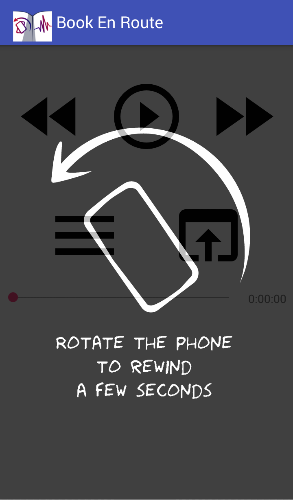
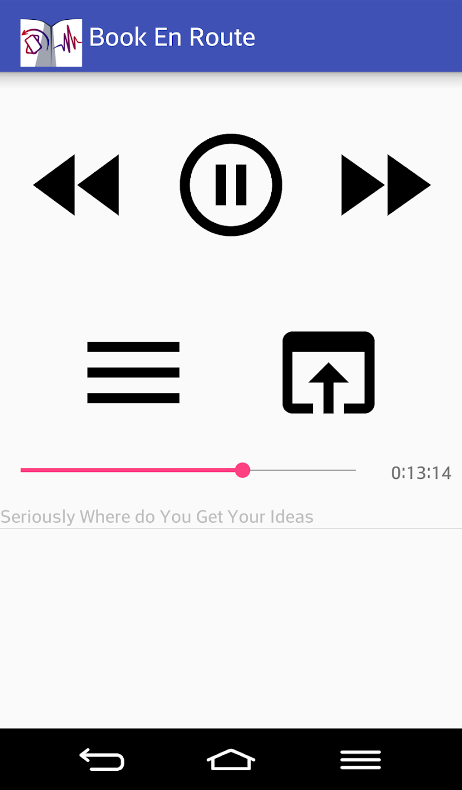
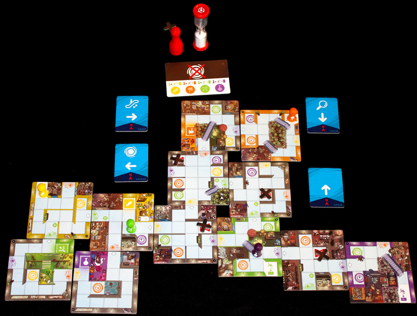
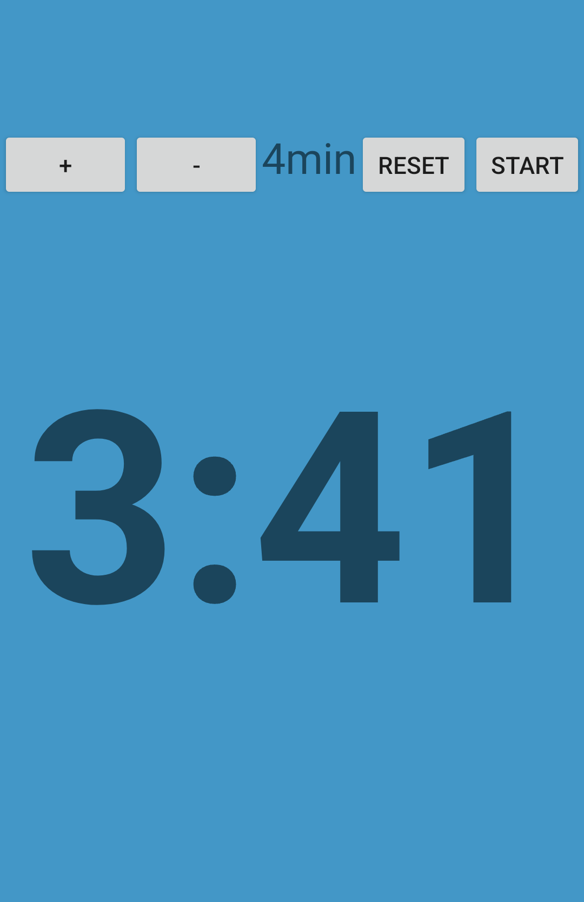
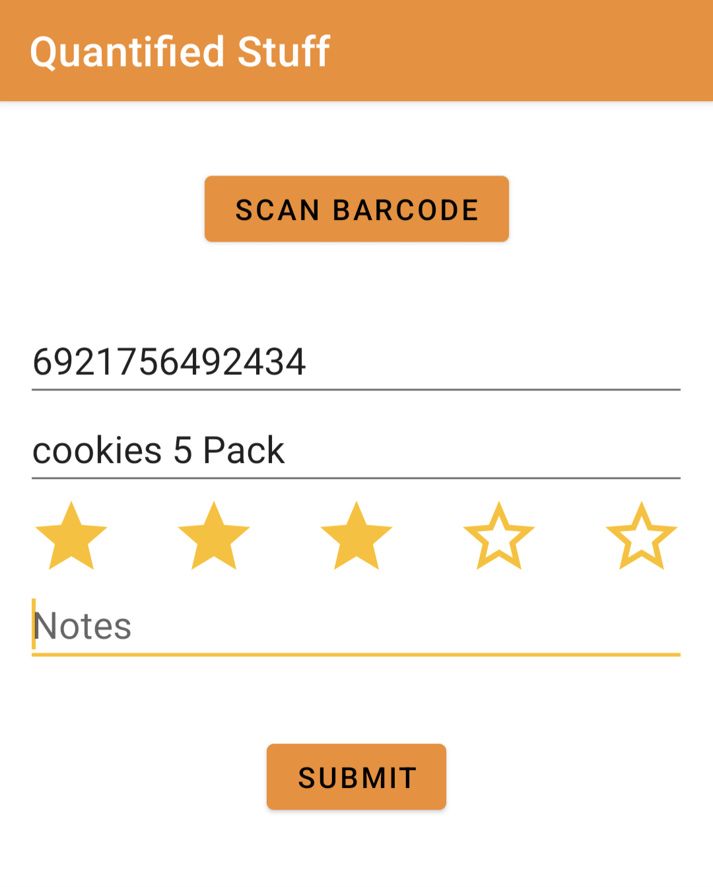

Mobile devices currently generate [most of the traffic](https://www.statista.com/statistics/277125/share-of-website-traffic-coming-from-mobile-devices/) on the Internet, with Android [being the most popular](https://gs.statcounter.com/os-market-share/mobile/worldwide) mobile operating system. I find it amazing that the whole ecosystem is open, and one can write applications for everyone with free tools. While I don't write mobile apps professionally anymore, I still occasionally create small programs for personal use.

## Android ecosystem

To develop Android apps, one needs to download an [Android Software Development Kit (SDK)](https://en.wikipedia.org/wiki/Android_SDK), which is a set of libraries with all the Android components, debuggers, simulators, and others.

While they can be used in any editor, Google created a standard editor: [Android Studio](https://developer.android.com/studio) to streamline the development process. It is based on a popular [Intellij IDE](https://www.jetbrains.com/idea/), which many developers are familiar with.

Android Studio supports two languages for writing Android apps: Java (the language the SDKs use) and Kotlin: a more functional language that compiles to JVM. Currently, Java is more popular, and I haven't tried using Kotlin yet.

To make downloading libraries, tracking their versions, and compiling the apps easier, Android Studio encourages to use a [Gradle](https://gradle.org/) build system.

Within the IDE, there are several features simplifying creating the apps, e.g. [LayoutEditor](https://developer.android.com/studio/write/layout-editor) which allows the users to edit the placement of elements in any screen in a visual tool that translates the changes to underlying XML, or [NavigationGraph](https://developer.android.com/guide/navigation/navigation-getting-started) which shows the graph of every screen (fragment) of the app, and their possible connections.

## Book en route

The motivation to write my first bigger app was listening to audiobooks. At the time, I was walking daily to work for half an hour. While I enjoy walking more than taking public transport, I felt I could do more with an hour/day commute time.

I started listening to audiobooks on my way, but when you roam around a busy place, you often get interrupted by the city noise. When it happens, unlocking the phone and rewinding the audiobook is annoying, especially in winter, wearing gloves.

[Book En Route](https://play.google.com/store/apps/details?id=ml.sygnowski.ber&hl=en_GB) is based on a simple idea to improve the experience of listening while walking. Apart from the usual features like queueing audio and stop/pause/fast-forward buttons, the app rewinds the audio by a couple of seconds when shaken. This way, you can quickly rewind the audio while walking.

Here, using the gyroscope library built into the Android system was relatively easy and only required a bit of tuning to get the rewinding sensitivity right. One part that took a bit more time was creating a tutorial screen where the phone would be animated to turn.

{width=40%}

In the end, I managed to use a vector graphic image of the phone with the arrow in [SVG](https://en.wikipedia.org/wiki/Scalable_Vector_Graphics) format. As SVG is a text format (which is basically XML), it was possible to choose a part of the image corresponding to the phone, wrap it into a `group`, and animate it in code:

```xml
<static path/>
<group android:name="rotationGroup" android:pivotX="43" android:pivotY="58">
  <path to animate/>
</group>
```

{width=40%}

### Experience publishing it on Play store

After I had an application running, I wanted to put it on Play store to make getting it easy (for friends and a future me). Overall, putting the app on the store wasn't too hard and there were a lot of tools helping to ensure that it works on different phones and Android versions.

However, after one sets up a developer account in Play, Google starts sending spam messages one cannot turn off along the lines of "Important tax changes in Vietnam". I understand they may be important to people selling their app in a number of markets, but they are completely irrelevant for a hobby app of mine.

After setting up the account, I wanted to take a look at how the marketing options look in Play store [^1], but it turned out that advertising one's app is not available to developers without a company account.

[^1]: not that I would like to spend money on advertising a hobby project.

## Hourglass timer

When I was spending time with my family during the pandemic, I bought a [Magic Maze](https://boardgamegeek.com/boardgame/209778/magic-maze) board game.

It's a cooperative game whose goal is to move the pawns=characters to particular places on a map, with a twist that each player doesn't own a particular pawn (blue, green, etc.) but rather a type of movement (right, top) which can be applied to any pawn.

The challenge of the game comes through the passage of time, as each mission must be finished before the time limit, measured by an hourglass, passes.

{width=90%}

The hourglass measures around 3 minutes. There are certain situations in the game when the players are allowed to rotate the hourglass. If it happens, the remaining time (until either end of the round, or turning the hourglass again) is however long it takes for the sand to move through the hourglass.

For example, if the hourglass rotates for the first time after 2 minutes, the next rotation will have to happen within the next 2 minutes, as this is the amount of sand on top of the hourglass after the first rotation.

As my family is not great with games, I thought it would be difficult for them to finish the game in time if we used the original 3-minute hourglass. To give them more time, without removing the time element (without which the game would be a bit pointless), I made an app that simulates the hourglass behavior: whenever it is clicked, the new remaining time is set as if there was sand moving through the hourglass.

An additional benefit to using the app instead of a physical hourglass is that if one clicks right after the timer has finished (the last piece of sand moved), the app doesn't allow it to be reset, whereas an hourglass would start anew without the players knowing that they should have lost already.


{width=40%}

In the end, my family managed to handle the original time limits well, and there was no need to use the app.

## Quantified stuff

During our lives, we buy a lot of products: a tube of toothpaste every month, a pizza every week or two sum up to hundreds of purchases of similar products over a lifetime. When making a decision on which one to purchase, we take into account various factors: price, how colorful the package is, previous experience with the brand, etc.

With human memory not being perfect, we often make suboptimal decisions: "was this one the great pizza that I ate a year ago, or should I buy all of them to try them one by one?". Inspired by [the Quantified self](https://en.wikipedia.org/wiki/Quantified_self) movement, I decided to make an app where I would be recording my experiences with various products, to be able to recall to them later.

I didn't want it to become a long project, so I identified the basic use case and decided to add some extra features only if they would be easy or at least funny to do.

The main functionality was:

1. To make a photo of a product, add some notes, and add a new entry to a database
2. search the previous entries in the database for information about a given product.

As I didn't want to build a custom front-end solution for showing the database entries, I decided to use a simple [Google Spreadsheet](https://www.google.co.uk/sheets/about/): it's easy to share between people, to edit manually or search through. There is [an API](https://developers.google.com/sheets/api) that allows you to get programmatic access to a spreadsheet.

Unfortunately, it turned out that inserting an image across a network is [unsupported](https://stackoverflow.com/a/43665027/1951176) in the Sheets API, so instead, I decided to make a photo of a barcode and treat the barcode value as a unique ID in the spreadsheet, and potentially get the name of the product from some external API based on that.

### Reading barcodes

I started the project by implementing barcode scanning. I expected that getting the photo would be easy, whereas reading the barcode may be more involved.

It was the other way around: the documentation suggests using a library called [CameraX](https://developer.android.com/training/camerax) to make a photo. It has a lot of features, in particular, to keep making photos until some predicate (in my case: being able to read a barcode) is satisfied. Unfortunately, the extra options came with the library being harder to use than I hoped for.

On the other hand, reading the barcodes worked seamlessly. The [ML kit](https://developers.google.com/ml-kit/vision/barcode-scanning/android) library had a class where you can choose which codes to try to scan, pass a photo and get the code back as a string.

Recognizing the name of the product back from the barcode also wasn't too involved. I found a [Barcode Lookup](https://www.barcodelookup.com/api) service, which claims to have 500M products in its database. Normally, one would have to pay for the API access to it (with only a month-long free trial period), but I found an alternative way to access the same API: [RapidAPI](https://rapidapi.com/hub), which allowed ongoing access to 10 queries/month for free, which is enough for my use case.

### Spreadsheet authorization

Accessing the spreadsheet programmatically became a real struggle. There are [three ways one can authorize](https://developers.google.com/workspace/guides/create-credentials#desktop-app) access to a spreadsheet:

1. API key, where every request has an extra parameter with a secret (fixed) authorization code
2. Service account, where we create a separate Google "account" and share the spreadsheet with it
3. OAuth client ID, where the spreadsheet is shared with the regular, "human" account of the phone's owner, and the user authorizes the app to access their spreadsheets programmatically.

All of them require setting up a Google cloud project, which would provide the authorization for the app.

#### OAuth

Out of the three options, I started with the last one (OAuth), as it was the only one documented in places where I searched at first.

I found a lot of libraries, either for Android or general Java, many of them deprecated, trying to facilitate the process of getting the user authorization, and read many sites explaining the OAuth authorization lifecycle.

In the end, [the process](https://stackoverflow.com/questions/74018613/auth-to-sheets-api-with-debug-version-of-android-build) looked as:

1. Creating a debug keystore to sign the app. To avoid situations where someone is impersonating the application (even though it's just a debug application and the app will have to store the secret key anyway).
2. Sign the application while building it and send it to the phone. I think I managed to do this within AndroidStudio, but it wasn't possible to easily check whether an application is correctly signed or not.
3. Generate an OAuth clientID which is based on the key's fingerprint and copy it to the app's source code.
4. Add extra permissions to the app to read the clientID. The clientID needed to provide the correct "namespace" of the application, but there wasn't an easy way to check whether the namespace of the application and the clientID match.
5. Use [a Play Services library](https://developers.google.com/android/reference/com/google/android/gms/auth/api/signin/GoogleSignInOptions) to request authorization from the user for accessing the spreadsheets.
6. Handle the result of the request to check whether the user agreed.

Unfortunately, even following this long process, I was getting a "Request Cancelled" error at the end and wasn't able to find out what went wrong.

After struggling with this authorization method for a while, I found out about other ways and decided to try them.

#### API key

I tried using the API key next, which I hoped would be much easier to set up: after requesting the key you only need to hardcode it into an HTTP request. And it was; unfortunately, the API key only supports reading from public spreadsheets, but [not updating them](https://issuetracker.google.com/issues/36755576#comment3).

#### Service account

After spending so much time trying to use the other authorization methods, setting up a service account was much easier than expected. After clicking through a series of questions on the project's page, I got a prepared email account like `test-1234@projectname.iam.gserviceaccount.com` and a file with a cryptographic secret to plug in the application.

Afterward, I only had to share the spreadsheet with that email as if it was a regular account and pass the credentials to a [HttpRequestInitializer](https://github.com/googleapis/google-http-java-client/blob/main/google-http-client/src/main/java/com/google/api/client/http/HttpRequestInitializer.java) in the app's code.

{width=40%}
