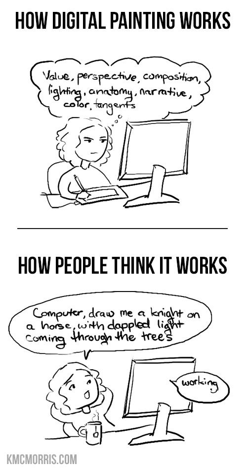
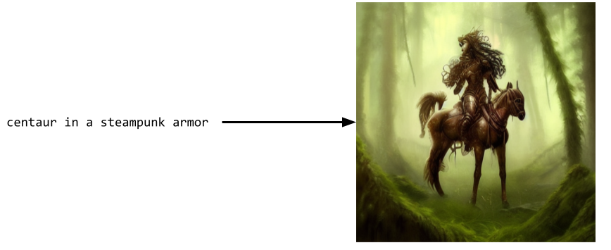
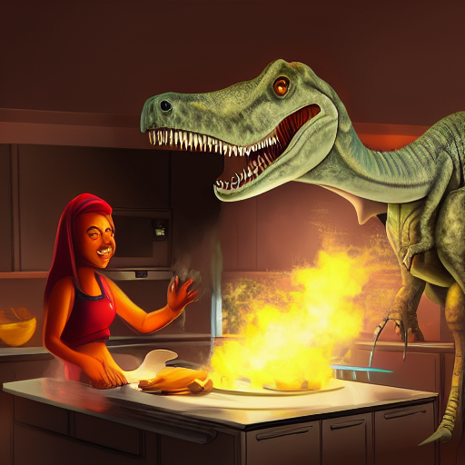
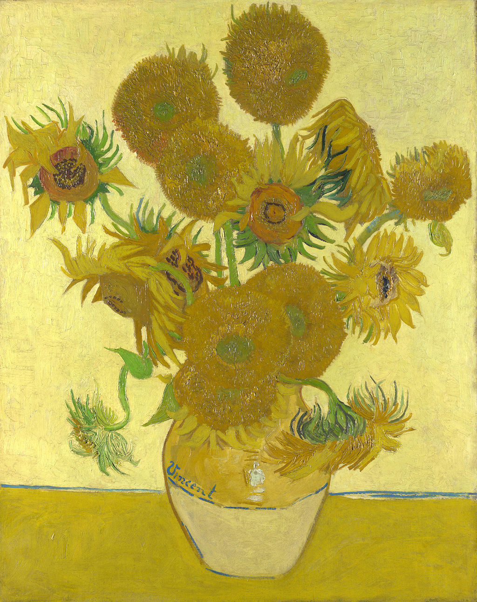
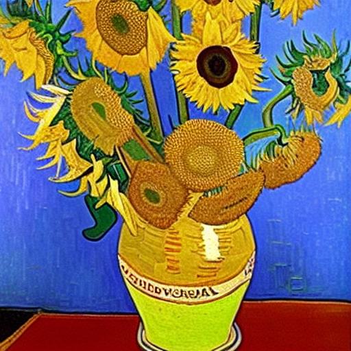
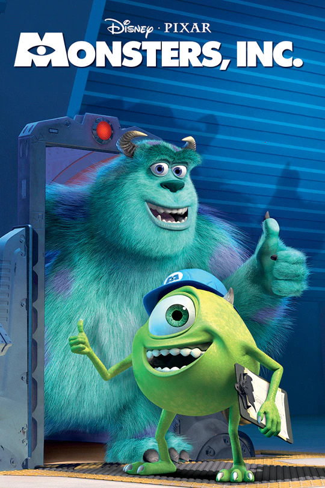
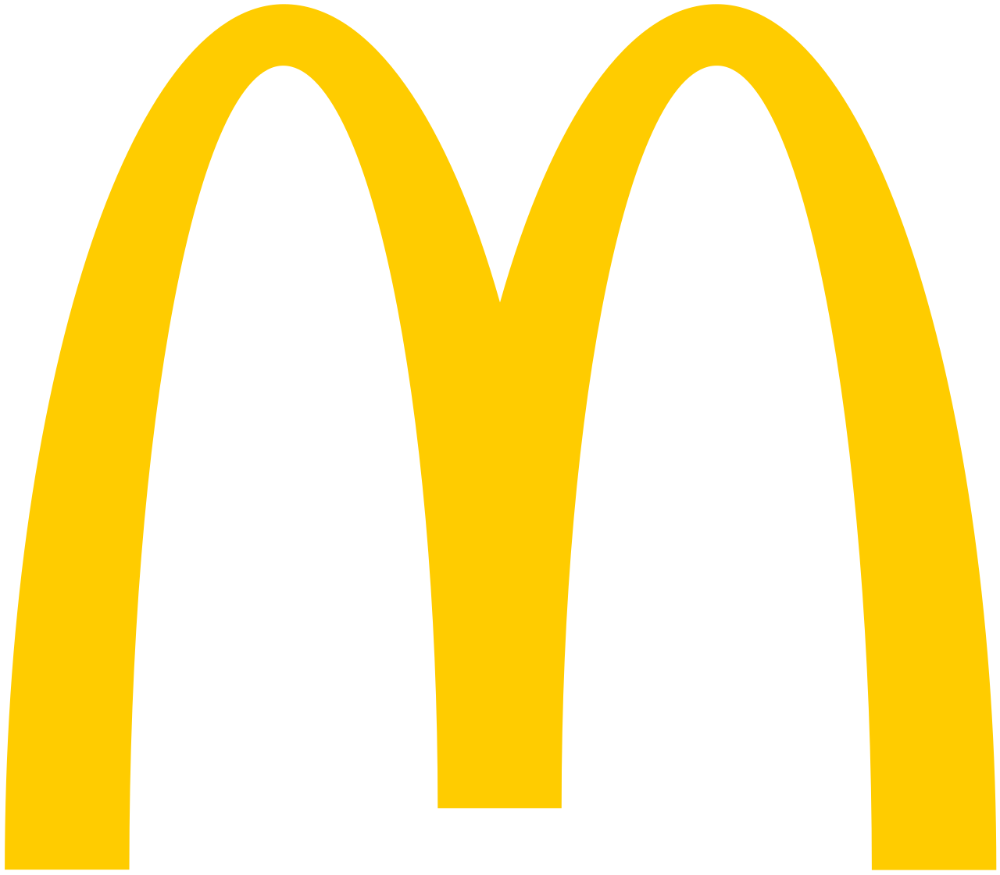

Humanity is making art since the dawn of time. With the improvement in technology, the entry barriers for starting a creative endeavor had been steadily lowering: what used to require lifetime training can now be achieved by hobbyists. Most recently, machine learning models have entered the scene, distilling the experience of generations of artists into a set of weights everyone can download and use.

The AI revolution is a special step on the road of continuously improving tools supporting the creative process, as:

1. the progress happened relatively unexpectedly: a year ago no one expected amateurs to be able to [create award-winning art](https://impakter.com/art-made-by-ai-wins-fine-arts-competition/) with AI
2. to make these models, the mere insight and work of the tool developer are not enough; their training process requires millions of examples of prior art which was created by artists who more often than not didn't consent to use their work in this way.

<figure>
[{width=40%}](../images/creative_ai/digital_painting.jpg)
<figcaption>
Digital painting meme from not so long ago.
</figcaption>
</figure>

It is thus understandable that AI-generated art sparks controversies among artists, who [call for increased legislation](https://edm.parliament.uk/early-day-motion/59805/artificial-intelligence-in-the-entertainment-industry) of the area.

## Current regulations

Most of the developed countries have some form of [copyright laws](https://en.wikipedia.org/wiki/Copyright) to prevent the use of creative works without the agreement of the author.

Typically[^1], it works like this:

1. an author creates a new, original piece of work: a poem, a painting, a song, etc.
2. upon creation of the material, they are automatically acquiring the exclusive right to take advantage of the work by selling it, making copies, or creating derivative works.
3. if the author chooses so, they may sell their rights to a third party, to let it use it in a bigger work (eg. someone creating 3D models for a computer game) or sell it directly so that the author doesn't have to deal with the publishing and distribution of their work
4. in case someone tries to use the work without the creator's agreement (either directly or by making a derivative work, which includes a significant portion of the original), the author may request the judicial system to enforce their rights and require the infringer to pay damages and stop using their creation.

[^1]: the rest of the post, I concentrate on the law of the United States, as it's the biggest market for the creative industry, and on the creation of images, as the image generators like [Stable Diffusion](https://stability.ai/blog/stable-diffusion-public-release) seem the most advanced among various mediums. The legal systems in other countries are similar, and it's clear that other forms of expression like music, video, books, or voice acting will suffer the same fate as images soon.

## How do AI models work

On a high level, the machine learning art generators all work the same way: they process a big database[^2] of art pieces of a given type to create a statistical model that maps some description (prompt) of an art piece (and usually a random seed, to allow for diversity) to the piece itself.

[^2]: these days it's going to be the whole internet, as it's the only "database" that is big enough for the models

{width=90%}

This model doesn't store the artworks themselves, but rather a big[^3] set of numerical parameters which contain the "knowledge" about how to create the pieces of art from the prompts.

The parameters are found in a (relatively expensive[^4]) training process, they are stored on disk and can be shared with people online. 

Having access to the trained model, one doesn't have to go through the training again; one can immediately start sending the prompts to the model and get the generated pieces of art. Processing of a single prompt still requires _some_ compute[^5], but customer hardware is well enough to handle it.

[^3]: as of 2022, each state-of-the-art image generator has on the order of 1 billion weights.

[^4]: training of stable diffusion cost $600,000.

[^5]: using my GeForce 1070 GPU, it takes around a minute to generate a 512x512 image with Stable Diffusion

## Legal or not?

So, is creating a tool like Stable Diffusion legal, or does it infringe on the copyrights of authors? What about using the tool itself? Who owns the right to such creations?

From the legal point of view, the question to consider is whether the generated art pieces are derived works of previous ones, ie. do they contain a significant portion of copyrighted works?

The decision on where to put the boundary of "significant portion" is a difficult one[^6], as the similarity between the two works is a continuous spectrum. Furthermore, even for a single art generator, its different "automated creations" will have a varying resemblance to previous works. On one end of this scale lies an image that is identical to a copyrighted one, where the user added it as a part of the prompt and tried to change as little as possible in an attempt to "launder" the art from its license. On the other end, there will be images with artifacts specific to the generation process which will bear no similarity to any work that the model was trained on.

{width=50%}

[^6]: described under a legal notion of a [threshold of originality](https://en.wikipedia.org/wiki/Threshold_of_originality)

Over the last couple of months, there were a number of court cases suing the models' creators for copyright infringement (e.g. [1](https://www.theverge.com/2021/9/29/22701167/bev-standing-tiktok-lawsuit-settles-text-to-speech-voice), [2](https://www.siliconrepublic.com/machines/open-source-piracy-matthew-butterick-microsoft-openai-github-copilot-lawsuit)). There will surely be more to come, with contradictory verdicts, while the courts will hopelessly try to interpret the inherently ambiguous rules one way or another.

### My opinion

Current law is clearly not prepared to deal with the current situation where the potential infringement is an effect of an automated process happening during the creation of the art-making tool. Under the [general power of competence](https://en.wikipedia.org/wiki/Everything_which_is_not_forbidden_is_allowed), the potential violation would have to follow the exact wording in the legislation, ie. someone would

> prepare derivative works based on copyrighted works

or

> distribute the copyrighted works[^7].

[^7]: there are 4 further exclusive rights protected by copyright, but they don't seem to lead to AI-specific issues.

Let's start with the creators of the AI models. They clearly don't "prepare derivative works", as they only train a model which, consisting of billions of incomprehensible weights, is not a derivative work on its own. Do the authors distribute the copyrighted works within these weights, though?

The goal of the training process is to learn the general patterns in the data, and not to encode particular works. With the relative size of the dataset and the checkpoints containing the weights (for Stable Diffusion: billions of images and a checkpoint weighing a couple of gigabytes), it's unlikely that the checkpoint contains much more than (uncopyrightable) general rules, as the average amount of information stored per image is only a couple of bits.

However, the statistical argument is not enough to argue that there aren't _some_ copyrighted works included verbatim in the model's network.

Even if this was the case, one needs to consider that the weights themselves are not the same as the catalog of images or videos that anyone can easily read. Even if there is a way to force the model to spit out a copyrighted image, one needs to consider how much effort it requires from the user.

An extreme example illustrating it is the [Library of Babel](https://babelia.libraryofbabel.info/slideshow.html): a website containing images with every possible sequence of pixels of a certain size, randomly generated and ready to browse. Technically, it's possible to find copyrighted works (both already created and all future works) in there; this is impossible in practice though, with every image one can realistically get resembling tv static.

{width=50%}

As such, I believe that Stable Diffusions, Github Codexes, etc. creators do not, on their own, violate the copyright of others. The tools they create potentially make it easier for others to break copyright law, but the same could be said about other, clearly legal tools like Photoshop or torrent clients.

#### On watermarks

The images generated by Stable Diffusion sometimes have watermarks or signatures added on top of them. This is an artifact of the training process: if a lot of "nice" pictures contain some form of the watermarks, the model will learn to include it whenever it tries to generate a "nice" picture.

However, the fact that the generated image has a watermark, even a recognizable one, doesn't on its own prove copyright violation. Unless the watermark itself is a major copyrightable element of the original (which is unlikely given its size and level of detail), if the image under the imprint is novel enough, it doesn't breach copyright laws[^8].

Based on the statistical argument above, it's most likely that, while the details of any particular image get lost in the network weights, the network remembers the watermarks as they are repeated many times over in the dataset. To prove copyright infringement, finding a watermark is not enough; one would need to show the actual copyrighted image that can be easily extracted from the model.

[^8]: there is a separate matter about trademark infringement, which I discuss below

It's quite clear that the model was trained on stock photos websites whose copyright holders didn't agree to it but so far training a model on the data that's available for free on the internet doesn't breach any laws (that I know of).

#### User-side

If the people creating the models don't break the law, what about the users, which enter the prompts and get art for free?

In principle, it depends on the results: if a user enters a prompt "Oil on canvas painting of Still Life: Vase with Fourteen Sunflowers by Van Gogh" and gets an image that is so similar to an original masterpiece, the user won't earn the copyright to its creation. If they used it as their own, it would be a breach (if it wasn't in the public domain anyway).

However, getting an image close to a previous work is very unlikely, as the network weights contain a very distilled knowledge about past art pieces. While the information on how to reproduce a "Van Gogh style" may well be present in the network, the particular images likely won't, even for popular works.

<figure>
{width=40%}
{width=50%}
<figcaption>
A comparison of the original sunflowers masterpiece by Van Gogh (left) and a Stable diffusion picture generated with the prompt with the name of the original works (right).
</figcaption>
</figure>

The "style" itself is [not copyrightable](https://theillustratorsguide.com/copyright-infringement/), as only a concrete piece of work can be a basis of copyright. The situation when copying the style is not any different when a human author creates a novel image while reproducing a style of others.

## Next steps for the copyright law

Given these intricate issues, courts will have a tough nut to crack during the copyright trials. It looks likely that changes in the legislation will be necessary to clarify it.

How _should_ the law be fixed, though?

To answer this, one needs to consider the ultimate reason for having the legal system: to define the system of behaviors to encourage and discourage, and to communicate and promote them. So, what is beneficial for the society in terms of creativity regulation of creative endeavors?

On the surface, AI models are only a new tool simplifying the creation of art in the long history of creative technologies. At the same time, making creativity more accessible changes the delicate balance of power in the industry, making it harder for authors to charge money for "simple" work that now everyone can do. Thus, it's necessary to analyze if the previous legislation is still appropriate in the new, post-AI reality.

### Copyright history

To see how the process of changing the law to suit a dynamic situation may look, one can take a look at the [history of copyright](https://copyrightservice.co.uk/copyright/history-copyright).

The first copyright law appeared after the invention of the printing press. Before that, the creation of new copies of books (and also other art: paintings, instruments, etc.) was very costly, so the authors weren't bothered that the replication of their work is taking place: as copying required significant effort, it didn't happen as often as later.

The printing machines, by causing literacy to go up, lead to all sorts of societal improvements. Initially, there was no extra regulation, and everyone could make copies of the books as they with, contributing to the further growth of education.

After a while, legislators observed that the incentives for writers to draft new books started to dry up, as most of the income from such creations would go to the copiers. Becoming an author became little financially beneficial, compared to the benefits that it brought.

To address the issue, copyrights were born, where the authors were assigned the transferrable right to create copies of their work.

These laws were revisited multiple times in history, e.g. with rights to patent inventions. More recently, internet and computerization, the effort required to reproduce any past work got effectively reduced to zero, prompting further changes in copyright laws.

AI is the next step in this process, when not only the past but also potential future works of a given artist can be effortlessly (re?)created. Similarly to the printing press, it decreases the motivation to create new work (which will sell for less).

It's worth adding that even before AI-generated art, the wider benefits to society are already considered when assigning copyright. A legal term of [fair use](https://en.wikipedia.org/wiki/Fair_use) encompasses situations when someone uses work that otherwise would be copyrighted, but is allowed as the benefits of doing so outweigh the damage.

### On licenses

A license is a form of contract, where the author of some work declares in what way it can be used. There are [dozens of types of licenses](https://opensource.org/licenses/alphabetical), clarifying issues like whether the work can be shared, derived work can be created, or whether there is any payment involved for using the work.

Amongst them, I tried to find a license that would prevent training a machine learning model on the data, but I didn't find any[^9]. One reason for the missing licenses is the fact that they would be hard to enforce: as we argued, the model itself is not a derivative work of the art pieces, and even if it was so, proving that a model was trained on a particular piece of art is infeasible.

[^9]: The closest came [Unreal Engine EULA](https://www.unrealengine.com/en-US/eula/mhc) saying that for MetaHuman, one may not "[use it] for the purpose of building or enhancing any database or training or testing any artificial intelligence (...) or similar technology"

Despite that, there is still value in creating a "not for model training" license, especially if it was joined with standards helping the automated scraping tools to find it.

First, I would like to think that the model authors want to do the right thing and honor the authors' wishes about how to use their work (and avoid even baseless court proceedings) if it is possible to process these wishes at scale.

A priori, right now it's not clear that the inclusion of works of a given artist in the training data of a model is harmful to the artist. While the popular ones may feel like they are being abused, others may gain popularity by their style becoming a popular prompt.

Furthermore, it's possible that the future law will change and it will become possible to prosecute model authors (or users) when training data was used without its author's consent.

Any licenses or disclaimers will only work for future art pieces, though, and won't affect authors whose works are already included in the models.

## Computer scientist perspective

We discussed a legal perspective on copyright which requires a definition of *novelty*, let's try to define it with mathematics. One could try to define it as creating something that one else made before, but it's a poor definition, as even tiny modifications (changing a single pixel in a 3hr long movie) satisfy it.

<figure>
[{width=35%}](../images/creative_ai/monsterinc.png)
<figcaption>
The poster of the Monsters, Inc. movie with a single pixel changed.
</figcaption>
</figure>

There is a branch of mathematics: [information theory](https://en.wikipedia.org/wiki/Information_theory) which deals with the questions of the information contained in a random process.

Without getting into too much mathematical detail, it measures how long should a binary number be to uniquely identify a given piece of content. It's related to how complex the work is and how big is the set of potential "works".

For example, if we want to identify a single word among all the words from [Oxford English Dictionary](https://public.oed.com/about/), it can be done using $\log(600\ 000) = 19$ bits. If it's a single image among all possible $512\times 512$ pixels described by $3$ numbers $0, \ldots,  256$ expressing RGB values, it'll be $2^{21} \approx 2\ 000\ 000$ bits.

We could use this concept to define a novel work, saying that "Change of $K$ bits of information is required for novelty" (for some concrete $K$). This would provide a unified framework for different types of creations, and would capture the element of "how difficult it is to create something"[^10].

[^10]: Many legal systems reject difficulty (called a doctrine of [sweat of the brow](https://en.wikipedia.org/wiki/Sweat_of_the_brow)) in considering copyright issues

Note that when using the information for defining copyright, discovering some particular piece among a wide group of potential works is considered a creative process, as it requires providing information amount of which is related to the size of the set.

Under this notion, one could take an AI model and see how long the prompt would have to be to generate a given piece of work and consider it novel if the contribution of the prompt author in the creation of the work was significant.

It would also clarify that the authors of the Library of Babel don't hold the copyright to all the possible images that their website can generate: even though one can get every image somewhere there, without locating it, the generative process cannot be considered creative.

Of course, in the context of actual copyright law, this is just a fantasy concept, as it would be difficult to implement it in practice. It's not intuitive for regular people (and probably lawyers either), and checking the level of novelty requires the knowledge of all the available tools: while the tool that the author used to create a given piece of art may require producing a lot of "information" (e.g. drawing a Mona Lisa pixel by pixel), there may be other tools which are able to make it easier (just searching for Mona Lisa online).

Finally, there are ways (see: [steganography](https://en.wikipedia.org/wiki/Steganography)) to add information to a work piece in a way that increases the information content without changing the perception of the piece.

## Trademarks

[Trademark](https://en.wikipedia.org/wiki/Trademark) is a legal concept similar to copyright. Instead of protecting an original piece of work, it protects a label that distinguishes the producer of some product. For example, a recipe for a Big Mac may be copyrighted (as writing it required some novelty), while the MacDonald's logo is a trademark: on its own, it's just a golden M letter, which likely wouldn't pass an originality test for copyright, but it is used to distinguish their shops from the competitors.

{width=35%}

Similarly to copyrighted works, trademarks are protected by law (although often require registration and use, as opposed to the rights automatically granted at the creation of copyrighted works).

The underlying motivation for the introduction of trademark laws was to allow brand building: if some company produces a product that people tend to like, seeing the same trademark on other products of that company may encourage people to buy it as well. Without it, for every successful product, there'd be dozens of imitations (potentially of lesser quality), which the customers wouldn't be able to distinguish. It would prevent companies from fully reaping the gains they deserve.

On the surface level, the concept of a trademark doesn't apply to the creative AI models discussion, as the generated art pieces (nor the originals) are not signs of any brand, company, or person: they are the "product" themselves. However, the name of the artists, which can be used as a part of the prompt, fulfills the definition of the trademark: it is a unique label that an artist uses to distinguish their art.

Even if advertising an AI model to "create art in the style of an artist X" (see e.g. [3](https://huggingface.co/ogkalu/Illustration-Diffusion), trained to reproduce the work of a Disney artist) is not illegal[^11], morally it is exactly a trademark infringement: the "brand" of the artist is used to advertise the copycat art of the model, which makes it harder for internet surfers to find the original art.

[^11]: as to make the trademark protected you often need to explicitly register it

In a recent [article](https://www.technologyreview.com/2022/09/16/1059598/this-artist-is-dominating-ai-generated-art-and-hes-not-happy-about-it/), [Greg Rutkowski](https://www.artstation.com/rutkowski) (a digital painter behind many Magic the Gathering art pieces) says:

> The online search [of my name] brought back work that had the name attached to it but wasn’t mine.

The potential legal problems related to the alleged trademark infringement seem to be one of the reasons that led the people behind Stable Diffusion to release a new [2.0 version](https://stability.ai/blog/stable-diffusion-v2-release) of their model. It retrains a part of the model called CLIP from scratch on a [new dataset](https://laion.ai/blog/laion-5b/), which doesn't contain contemporary artists[^12] (the [previous version](https://huggingface.co/CompVis/stable-diffusion-v1-4) used a network pretrained by OpenAI on an undisclosed dataset).

[^12]: or at least I didn't find them when browsing the dataset

Understandably, the restrictions in the training data made the model to stop responding to the popular prompts based on artists' names, which caused a [backlash from the users](https://www.reddit.com/r/StableDiffusion/comments/z3ferx/xy_plot_comparisons_of_sd_v15_ema_vs_sd_20_x768/).

## On incentives

The creation of new models makes it easier for the masses to create art, which is good for overall creativity, as more art gets created because of them.

The current (non-AI) artists are not happy about the models, as it goes against their interests: their previous work is used to improve the models, which creates more competition for their art.

While using the model also requires some knowledge and artistic skills help to get better results from the AI, for many use cases, potential clients will often choose to use AI to get 90% of the effect of a professional artist instead of employing one.

One could argue this is the same as with human junior painters learning to replicate the style of big authors, but there is a crucial difference that one can do it now without years of study and for free. Using Stable Diffusion to get an image of Beksiński is way simpler and cheaper than ordering a commission, which wouldn't be the case with paint-alike authors: they may be cheaper, but still cost the same order of magnitude.

Given all these disincentives, why are the authors share their work at all on the internet?

First of all, the models that are any good only started to appear recently: most of the art pieces online were uploaded before anyone could think that the models of current proficiency will be created so soon.

But even now, there is a big incentive for artists to put their work out there: when people visit an artist's page, the artist builds an audience, which will bring them new clients for commissions or donations. For many (e.g. online comic artists) this is the only source of income.

With the works being read by a heartless machine and used to train the model of an artist's style, this balance moves a bit away from encouraging sharing, but overall, I suspect it'll stay beneficial for artists to keep a wide online presence.

## Summary

The novelty is a spectrum and it's hard to formally define what is novel enough to be copyrighted. The new AI-based models democratize the process of creation while moving the incentives of the current creators a bit away from sharing their content online.

It's inevitable for simpler works people will use the models for free instead of paying the artists. The artists will be able to learn to use the new tools better which will help them to create art faster.

I find it morally and legally acceptable to use the models trained on art pieces, even though artists likely didn't consent to their work being used this way. I expect in the future artists will mention on their websites the lack of consent for using their art in this way.

On the other hand, I think finetuning the model to simulate the style of a particular artist and publishing it online is morally vague.

It's going to be interesting to see how the law, art practice, and the internet will evolve to adjust to the new reality.
