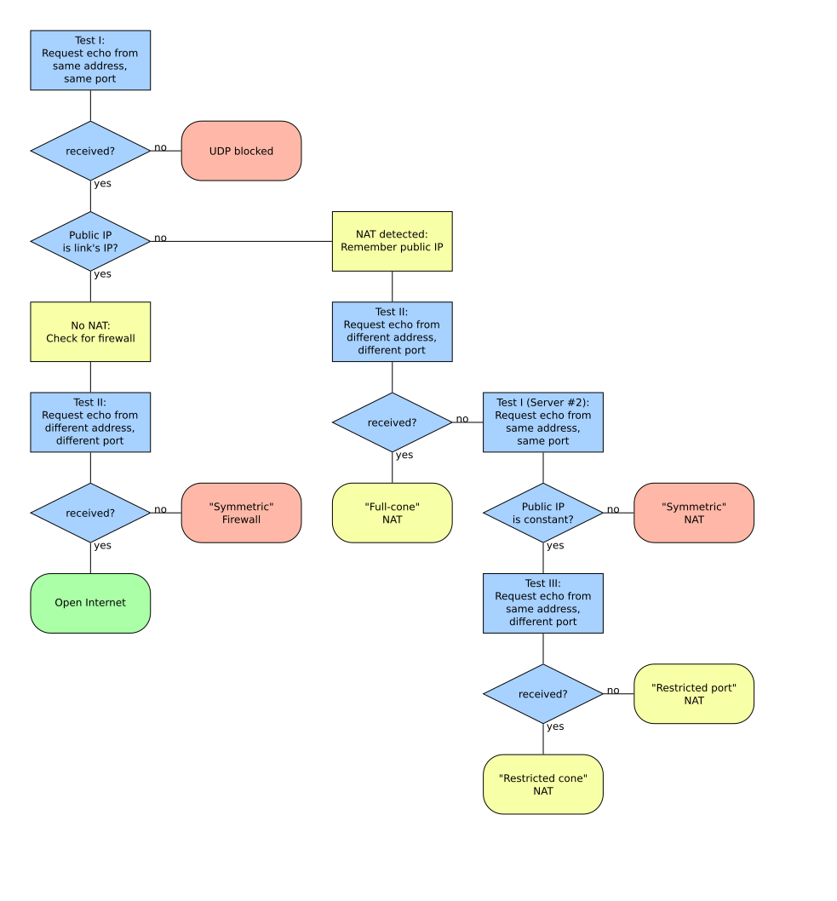

The internet typically relies on a client-server model, where a server hosts websites or applications, and users access them through their devices. However, this model may not be suitable for certain functions, such as file sharing or video calls. That's where peer-to-peer communication comes in, enabling users to directly connect and communicate without a server. To make building peer-to-peer applications easier, developers created the [WebRTC](https://en.wikipedia.org/wiki/WebRTC) protocol.


## Point-to-point connections

At a fundamental level, all information transmitted over the internet must travel between two machines: whether it be through cables carrying electrons, electromagnetic waves of varying frequency, light signals, or [pigeons](https://en.wikipedia.org/wiki/IP_over_Avian_Carriers) transporting the data directly.

When connecting to a website, there will be various intermediary devices such as routers, load balancers, hubs, and internet exchange points between the originating machine and the final destination.

<figure>

```source
$ tracepath sygnowski.ml -l 60
 1:  hyperhub.mynet                          0.933ms 
 2:  100.96.79.1                             4.020ms 
 3:  172.16.27.166                           4.093ms
...
15:  cdn-185-199-108-153.github.com          5.074ms
```
<figcaption>
It takes 15 direct connections (hops) to reach the server where this blog lives from my home computer.
</figcaption>
</figure>

## Distributed topologies

There are more than 10 billion devices connected to the internet, with varying connection patterns. 

For many applications, a single server that controls service's state and responds to requests from multiple users is a natural connection topology.
You wouldn't want your neighbour's fridge to connect to your smartwatch, or your bank's computer to request authorization from others before displaying your account statement[^1].

[^1]: Right, Bitcoin?

However, in some cases, a more direct connection between users is desirable, such as when you're talking on Skype with a friend and want to establish a direct connection to their device without involving Microsoft.

Besides increasing privacy, a direct connection can also result in smoother comunication, as there is no intermediary and data can potentially travel along a shorter path.

### On latencies

In the agent of instantaneous online communication, it may seem like the physical limitations of transferring bits of information are negligible. However, let's examine the numbers:

1. It takes approximately [130ms](https://www.grc.nasa.gov/www/k-12/Numbers/Math/Mathematical_Thinking/how_fast_is_the_speed.htm) for light to travel around the Earth. In theory, this means any two points on the planet's surface can be connected via a path with 65ms of latency, assuming the shortest possible route (i.e., [a great circle](https://en.wikipedia.org/wiki/Great_circle)) and no delays caused by intermediary devices.
2. Humans are capable of [perceiving changes in their vision occuring every 10-20 milliseconds](https://news.mit.edu/2014/in-the-blink-of-an-eye-0116). While a typical monitor refreshes at a frequency of 60Hz (16ms), 120Hz monitors are also available.

Together, these facts suggest that routing a call to a friend who lives next door in Prague through Microsoft's servers in Seattle[^2] not only wastes resources but also creates a noticable (and unavoidable) delay in the call.

[^2]: Of course, Microsoft has servers all around the globe, for that very reason.

## IP address exhaustion

In order to connect two devices over a network, one device needs to know the address of the other. Originally, IP addresses were meant to serve this purpose, with every machine connected to the internet having a unique IP and intermediate routers directing traffic to facilitate any connection. However, it quickly became apparent that the original space of the addresses (of the form of 4 numbers between 0 and 255, like `156.513.0.42`) was too small to assign a unique IP to every device, with only around 4 billion available IPs.

To solve this problem, the concept of [a private network](https://en.wikipedia.org/wiki/Private_network) was born [^3], which is a network of devices belonging to a single entity (e.g., a single household, building, or even an Internet Service Provider) with addresses that only need to be unique within the smaller network, not the whole internet.

[^3]: The Internet Protocol standard has since been updated to its [6th version](https://en.wikipedia.org/wiki/IPv6) which has a much larger address space, but the use of private networks has continued.

Within a private network, only some of the devices are directly connected to the rest of the internet and have public IP addresses. Let's call the machines only present in the private network as *private devices* and the publicly addressable ones *routers*.

## Network Address Translation

Sending a message from a private device to a machine on the internet is relatively easy. To do so, the device sets the destination address to the known public address[^4] and passes it down to the router. The router, connected to the internet, forwards the message to the next machine until it reaches its intended recipient.

[^4]: Let's ignore the matter of [domain name resolution](https://en.wikipedia.org/wiki/Domain_Name_System) in this post.

However, it becomes more complicated when an external server needs to send a message back to a private device. Since the device only has a private, non-unique address, standard routing won't work.

This is where [Network Address Translation](
https://en.wikipedia.org/wiki/Network_address_translation) (NAT) comes into play. NAT is a mechanism used by a router to reserve an open port for communication with a specific private device. The external machine sends a message to the router on this port (which is publicly accessible), and the router translates the address to the appropriate private address that it has stored in the part of its memory called a NAT table.

The port can be opened (and its corresponding NAT table entry created) explicitly by the user in the router settings, but typically it gets created whenever a message from a private device leaves the private network for an external destination.

This way, NAT also serves a security role by allowing private devices to establish connections with external services, but no the other way around. An external attacker may get to know the IP address of the router, but the connection with the devices behind NAT can only be initiated from the inside.

In additon, there is an address-dependent version of NAT: only a device with the same external address as the original one contacted by the private device can use the open port. This makes it impossible for a third party to use a port on a router that has been opened when the private device contacted someone else.

NAT allows a device on a private network to establish contact with a server having a public IP. However, creating a connection between two devices in two separate private networks remains a challenge, and this is something that WebRTC attempts to solve.

## WebRTC: general idea

The networking issues related with establishing a peer-to-peer may seem difficult to solve at first, but once a solution is found, it can be reused for many different use cases, such as video chat, file sharing, and games[^5]. These use cases all require a direct, two-way connection between peers.

[^5]: Note that in some multiplayer games, cheating may be a concern when using a peer-to-peer connection, as it may allow players to alter the game state. For this reason, some games use a client-server architecture.

WebRTC is a protocol that describes how to establish such a connection, allowing developers of real-time peer-to-peer application to use it directly and focus on implementing their specific logic.

### Signalling server

Since connections with a device in a private network can only be initiated from within the network, the WebRTC protocol requires access to an external server that is accessible to both ends of the connection.

This may seem counterintuitive, as the whole point of using WebRTC is to avoid a centralized server that relays traffic between clients. However, the signalling server does not pass all the data between the clients; it merely creates the connection between peers. Once the link is stable, the peers disconnect from the signalling server and continue their exchange directly.

The signalling server is typically application-agnostic; it only needs to pass a few messages from one client to the other and back.

### STUN servers

So, how do we use the signalling server to establish a connection? Let's imagine that we know the public IP of the router in front of a client, and an open port on that router that redirects to the client. We could pass this information through the signalling client to the other peer, and it would be able to connect directly.

But how do we open the port and get this address in the first place? This is the role of a [STUN](https://en.wikipedia.org/wiki/STUN) server. It is a standalone, publicly accessible server whose only job is to respond to the incoming messages with the IP address of the sender.

It works as follows:

1. The client, behind NAT, sends a message to the STUN server.
2. The router, on the way to the server, opens the incoming port to forward the responses back to the client, and changes the sender IP to its own, as is usual with outgoing traffic.
3. The STUN server receives the message, copies the sender address to the body of its answer and responds back.
4. The router receives the message and forwards it to the client.
5. The client receives the message with the body containing the public address and port of the router.


<figure>
[{width=85%}](../images/webrtc/stun.png)
<figcaption>
A detailed diagram of the STUN diagram, explaining also the type of NAT between the client and the server. [Work](https://commons.wikimedia.org/wiki/File:STUN_Algorithm3.svg) by Christoph Sommer.
</figcaption>
</figure>

As this interface is relatively cheap and doesn't require a lot of traffic, there are [a number of free STUN servers available](https://gist.github.com/mondain/b0ec1cf5f60ae726202e), e.g. `stun.l.google.com:19302`.

### TURN servers

We mentioned previously that in some versions of NAT (called symmetric NAT or having Address Dependent Mapping), the open port on the router is only accessible by the recipient of the original message from the client (not by any device on the internet).

This is unfortunate for establishing the connection using a STUN server. In that situation the client will receive an answer from STUN with the address of its router and a port, but it can't be used by the peer for a direct connection, as NAT will refuse to forward a message coming to this port from anyone else than the original STUN server.

If both peers are using address-dependent mapping, all hope is lost. However, if only one of the peers is behind a symmetric NAT, the situation can be salvaged, as it can initiate the connection.

In such a case, people usually resort to using a [TURN server](https://en.wikipedia.org/wiki/Traversal_Using_Relays_around_NAT). It is a fancy name for a very simple relaying server that forwards all traffic from one peer to another. It's a resolution of last resort, as it doesn't solve the issues with server-client model that peer-to-peer connection was meant to solve. TURN is still a single server, which needs to be paid for and can increase the latency of communication between peers.

According to [statistics](https://xirsys.com/pricing/), around 15% of the peer-to-peer connections require the use of a TURN server, and current prices are around $0.50 per 1GB of traffic.

### Putting it together: Interactive Connectivity Establishment

When peers attempt to establish a connection, they cannot predict whether they will require a TURN server, STUN, or neither (such as when they are in the same private network and can connect directly).

Interactive Connectivity Establishment (ICE) is the process of negotiating the best possible connection between them. It involves each client independently querying STUN and TURN servers it knows to construct a list of public addresses and an open ports where it can (potentially) be reached.

These proposals, which typically include answers from both TURN and STUN servers, are referred to as ICE candidates. They are sent (offered) through the signalling server, and then both peers attempt to use the candidates they receive, one after the other[^6], to reach the other side.

[^6]: Typically, responses from STUN servers would be higher on the list since direct connections are cheaper than relaying everything through a TURN server.

If one of these attempts is successful and one peer receives a message from the other, the connection can be established. This means that a peer can be reached using a public address, and a connection from within the second peer's private network can be initiated. At this point, the candidate is accepted, the connection with the signalling server can be terminated, and the rest of the exchange can occur directly between the peers.


## Example use-case: game lobby

Let's review how WebRTC establishes a peer-to-peer connection in a game lobby example.

1. One player connects to the signalling server and creates a new "lobby"
2. Another player connects to the signalling server and selects the same lobby, either by passing an ID, password, or choosing a lobby from a list[^7].
3. The clients of both player send requests to the STUN servers they know and collect the answers, along with the addresses of the TURN servers it knows, into a list of ICE candidates.
4. The clients exchange candidate offers one after another via the signalling server. Once an offer is received, the receiving client tries to use it; if it works, it is accepted, if it doesn't, it's rejected.
5. When the offer is accepted, the clients keep the established connection and use it throughout the rest of the session, and then disconnect from the signalling server.
6. The signalling server removes the lobby as it's no longer needed.

[^7]: Lobby implementation is not part of the WebRTC protocol.

Using WebRTC allows developers to reuse tested implementations and workflows, making it much simpler to establish a peer-to-peer connection.

