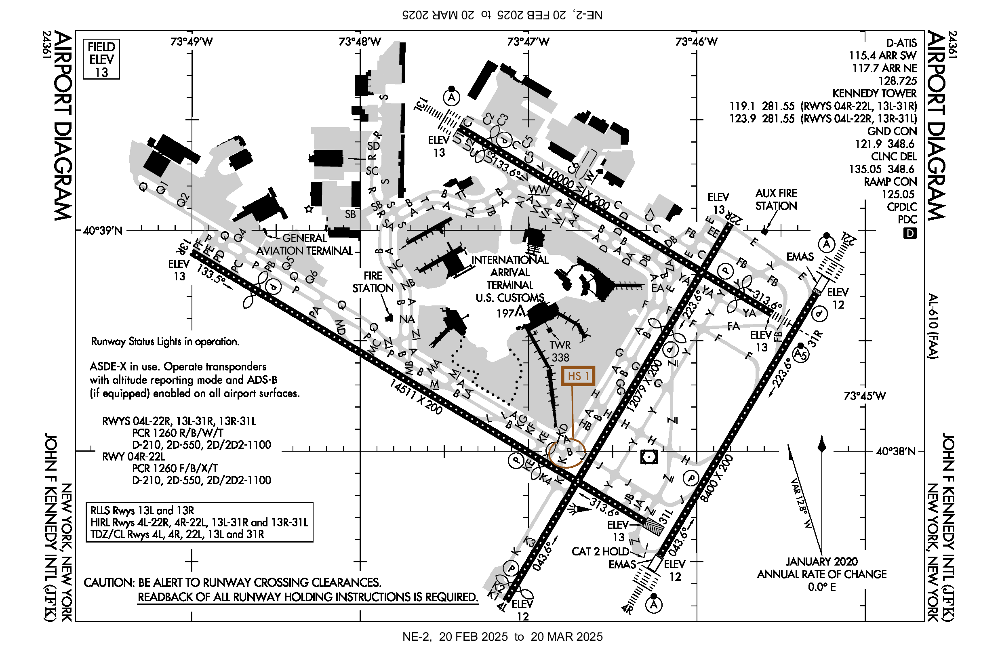
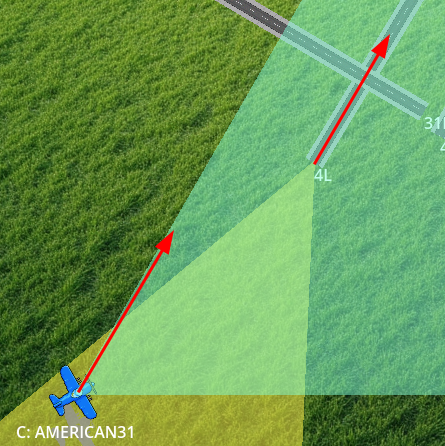
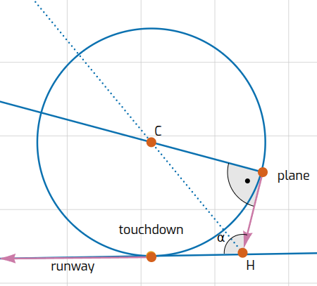
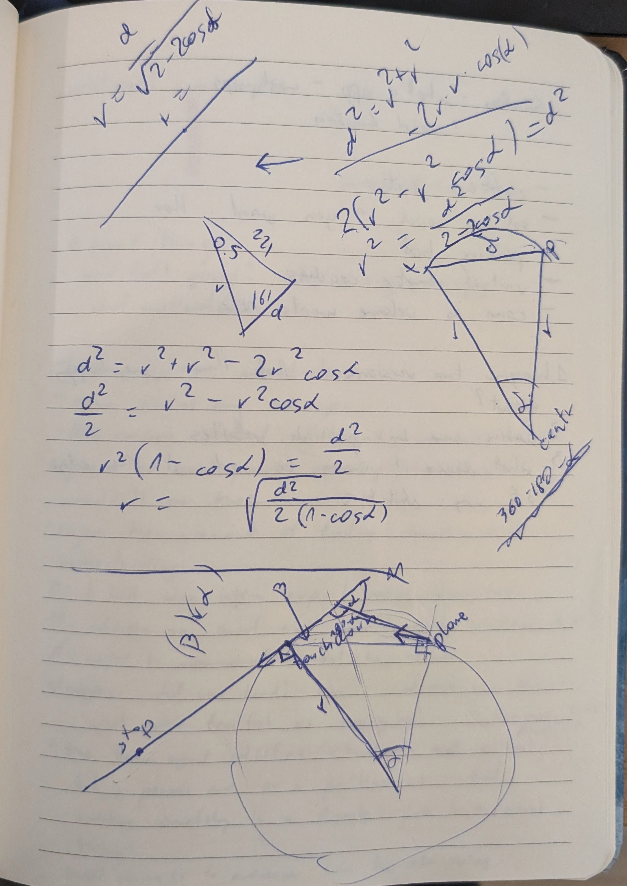
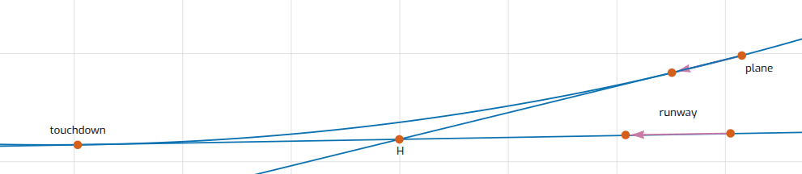
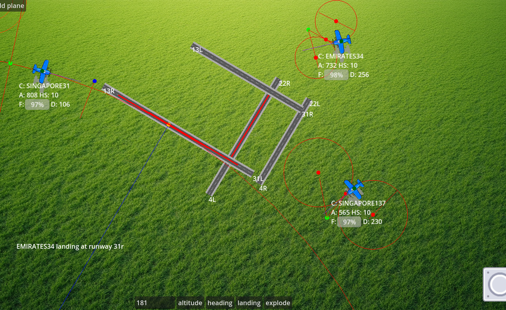
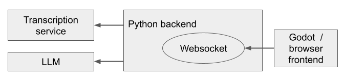
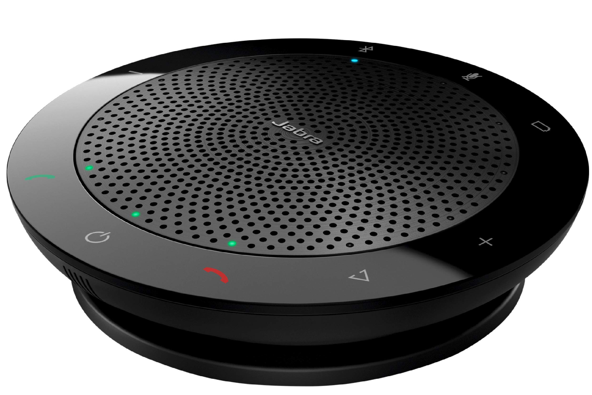
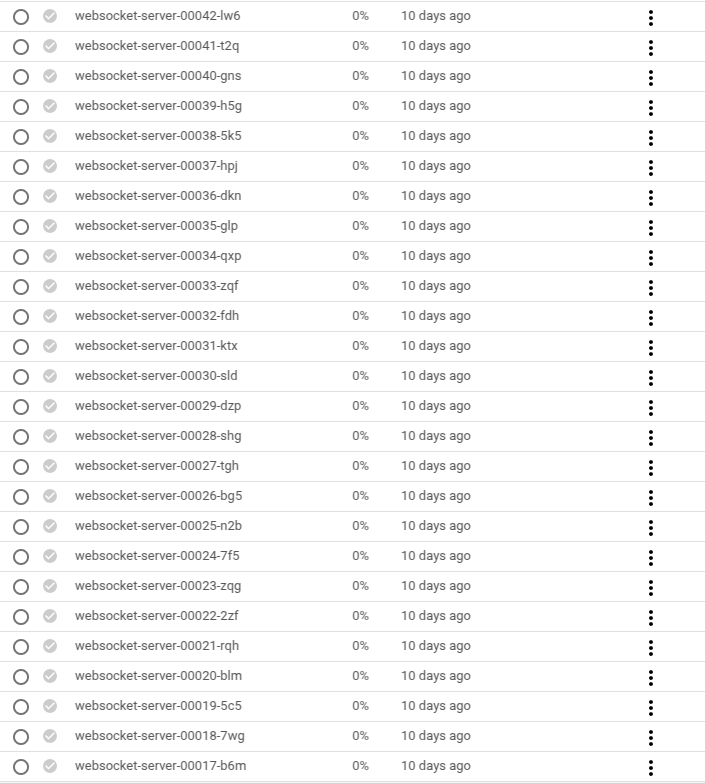
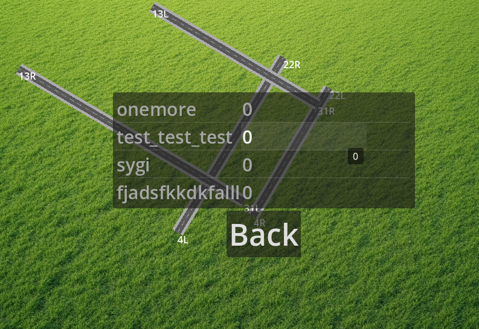

I find the work of air traffic controllers fascinating, scary, and powerful as they can move the planes with the power of their voices. To act on this feeling, I made a simple [game prototype](https://sygi.xyz/atc) in which the player is an ATC trying to land the airplanes safely.

Note: this post is a long (~25min) read, closer to an unorganized stream of consciousness than a polished article telling a coherent story.

## Idea and preparation

I wanted the game to feel like being an air traffic controller as much as possible while keeping it not too difficult (and not killing people on the way if possible).

To understand what it entails, I searched the internet pages related to aviation. I was amazed to be able to find a lot of data on the related topics.

Regarding airports, I found pages containing everything from coordinates, ATC frequencies, the presence of automated beacons helping to localize the runway, weather minimums, to every possible arrival and departure trajectory.

For example, [here](https://skyvector.com/airport/JFK/John-F-Kennedy-International-Airport) is information about John F. Kennedy International Airport (JFK) whose runway orientation I used in the game.

{width=90%}

Every civil flight trajectory is recorded and accessible to the public on pages like [flightradar](https://www.flightradar24.com/). However, these websites usually charge a (quite substantial) fee for access to trajectories, so they don't fit my use-case. I found one place: [flightstats](https://developer.flightstats.com/getting-started) that supposedly gives a 30-day trial which would suffice for my needs but it only serves companies so I decided to not waste a lot of time on getting this data.

Interestingly, the airplanes' [transponders](https://en.wikipedia.org/wiki/Transponder_(aeronautics)) that broadcast their positions and call signs via radio are pretty strong and we were able to listen to a couple of them approaching JFK when sitting in an office in Brooklyn.

Regarding ATCs, as communication with them happens via radio on publicly known frequencies, people set up scanners close to the airport and stream them live on websites like [this one](https://www.liveatc.net/). It streams the conversations from hundreds of airports around the world.

Furthermore, all the rules of aviation communication are documented on FAA pages, eg. [here](https://www.faa.gov/air_traffic/publications/atpubs/aim_html/chap4_section_2.html). I based the commands in my game on the information from [here]( https://wiki.flightgear.org/ATC_phraseology).

Finally, when designing the flying dynamics, I took inspiration from [this game](https://atc-sim.com/simulator) which has a similar premise to my prototype but doesn't involve speech.

## Scope
Initially, I had a wide scope in mind, live-streaming planes' trajectories, playing the communication from the pilots, etc.

At the same time, I hoped the prototype could be implemented in a week or two (a deadline that I didn't make in the end), so I decided to cut the scope to:

1. the planes with randomized call signs continuously arrive on the scene
2. the player can issue four commands:
    a. change altitude
    b. change heading (ie. direction)
    c. land
    d. hold
3. the score is the number of planes that landed successfully and the game finishes when there is a collision between planes, a plane runs out of fuel, or flies out of the scene.

## Flying dynamics

I wanted to keep the flying dynamics simple, focusing on the speech UI to make the game fun even if not all commands are recognized correctly.

To get there, I made the following assumptions:

1. the planes fly forward with fixed speed and altitude
2. after receiving a command to change altitude, the plane will linearly climb/descend to that altitude. Planes can only collide if their altitudes are close to each other.
3. when asked to change heading, the plane will keep linearly rotating until it reaches that heading, while still flying with a constant speed, effectively turning in a circular pattern
4. holding is implemented as constantly turning in circles using the same rotation speed as with the heading change.
5. the landing clearance includes a particular runway and it is accepted when:
    a. the plane's position is within 60° cone from the start of the runway.
    b. the plane's direction is within 30° of the direction of the runway (it's impossible to land if the plane is not roughly pointing towards the runway)
    c. the plane's altitude is low enough for descending to the ground before it reaches the runway.

{width=50%}

6. once the landing clearance is accepted, the plane lands autonomously and, once stopped on the ground, disappears from view, making space for the following planes.

### Landing dynamics

As the planes are to land on their own, the game developer (me!) needs to define the exact trajectories for them to follow.

I wanted these trajectories to adhere to these rules:

1. the trajectories are smooth, ie. start with the planes being in the same position as they were before landing and make linear changes to rotation and position
2. there will be two stages of landing:
    a. aligning with the runway direction of the runway
    b. flying straight and exponentially slowing down on the runway
3. the altitude will decrease linearly to 0 in the first stage above.

The only tricky part was defining how to align the plane with the runway.

#### Aligning with the runway

To get a smooth landing trajectory, one can try drawing a circle that contains both the plane position and the desired landing position and is tangent to both the runway and the plane's directions.

Formally, one can construct it like this:

1. let's take a vector starting in the plane position and going in the direction of the plane
2. intersect it with the line that contains the runway, creating angle α
3. bisect α and intersect the bisection line with the line tangent to the plane direction, resulting in point C.
4. draw a circle with C as a center and such a radius so that the initial plane position is on the circle.
5. the trajectory we were looking for is an arc of this circle starting from the plane position and ending at the point of tangency with the runway line.
<figure>
{width=40%}
{width=40%}
<figcaption>
    Left: visualization of the construction of the landing trajectory, right: scribbles to figure all this out.
</figcaption>
</figure>


This construction only works if the plane is pointing towards the runway. What's worse, the construction defines the touchdown point as one of the points on the runway line but that point may be far away:

{width=80%}

#### Aligning with the runway 2

I would like for planes to accept the landing command whenever their direction is within an angle from the runway direction. For the situations when the simple circular trajectory doesn't exist or touches the runway line too far away, I need to do turn turns:
- first, turn towards the runway
- then, turn back to align with the runway

There are several ways to achieve that. To decide on something, I assumed that both turns happen on the circles with the same radius.

After some more scribbles, I figured out a piece of math that allowed me to check, whether a given radius `r` is too small or too large to draw a trajectory using my method.

I am confident that this problem has a closed-form solution. In the interest of time, I decided to run a couple of optimization iterations to calculate a good enough radius, though.

{width=70%}

## Implementation

I started the implementation by figuring out how to make the audio work.

### Initial audio explorations
I knew I wanted the game to be playable via a browser to make it easily accessible.

Thus, I started by exploring the capabilities of audio recording in the browser using JavaScript and sending the recording over on the fly.

This was surprisingly difficult to achieve: there is [a web API for recording](https://developer.mozilla.org/en-US/docs/Web/API/MediaDevices/getUserMedia), but the data, even in the simplest, uncompressed format required some preprocessing from float to int for transport but the audio chunks contained some extra format headers and processing them and making sure they are sent down correctly was not trivial.

Once I was able to send the audio data from the browser I started to think about how to implement the graphics and decided to use Godot. Initially, I was worried whether I would be able to record audio from Godot, especially as I discovered the audio recording from a Godot example [didn't work](https://github.com/godotengine/godot/issues/102316). 

However, as I played with the engine, I made it work with a different audio recording mechanism.  The communication between recording in the browser and the Godot engine proved tricky, so I moved all audio processing to Godot.

I just needed to make sure that the audio module doesn't start in the main menu screen, as otherwise Chrome blocks all audio due to forbidden [autoplay](https://developer.chrome.com/blog/autoplay/#webaudio).

### Architecture

The architecture ended up like this:



The information flows as follows:
1. Godot runs in the browser and connects to the backend python script via a websocket.
1. the user records the audio command in Godot
2. the audio is sent to the backend via the websocket in ~half-a-second or so chunks
3. the backend sends the audio to an external voice recognition API on the fly
4. the resulting transcription is sent to an external LLM API to interpret it as one of the game commands
5. a JSON with a well-formatted command is sent back to Godot using the websocket.
6. the command is interpreted by the engine and a response is played.

Let's now get deeper into the implementations of particular parts.

### Voice recognition

For transcriptions, I used a V1 version of Google [Speech-to-text API](https://cloud.google.com/speech-to-text?hl=en) which is free for the first hour per month.

At some point, I tried the V2 of the API which was supposed to be more accurate, but in my experiments, there was no noticeable difference. I also tried sending audio as part of the LLM input to save one round-trip of latency. I decided against it as the accuracy was worse and the documentation for streaming inputs (as opposed to outputs) to the LLMs was quite terrible.

Initially, the accuracy of recognition was not great, but I found two unintuitive mechanisms that improved it:

1. increasing the sample rate of the samples being sent from 16kHz (which was the default displayed in example codes) to 44100kHz
2. increasing the microphone gain so that the audio gets recorded as loud

Overall, the delay between the end of speech and the command being accepted and returned to the game engine was around 300-500ms, which isn't too bad.

The accuracy of the voice recognition was acceptable, I estimate ~60%[^1] of my, and ~90% of the commands of my native-speaking friends were understood correctly (even in a noisy room when using the Jabra speakerphones)

{width=50%}

[^1]: all numbers in this section are just based on my impressions, I didn't do a thorough study.

### Voice synthesis

Apart from sending the user commands to the backend and interpreting the resulting JSON commands, I wanted to give the player a voice confirmation of the command being issued (and potentially a rejection reason for landing).

I started by just using a couple of pre-recorded messages "Please repeat", "Can't land from this angle", or "Climbing to X thousand feet". I liked this solution as it allowed me to apply audio effects on top of the audio which made it possible to add radio static and generally made it sound authentic.

However, for the content of the responses to be accurate, they need to contain the call sign of the plane, and the details of the command issued, eg.
```
United-4-2, turning right to head 0-7-0
```

As I definitely didn't want to automatically record thousands of different commands/call-sign combinations nor to patch them on the fly hoping that the result doesn't sound too robotic, I opted for using text-to-speech solutions.

Godot has built TTS support, but the voices there (on linux) sounded quite robotic. However, as I learned, modern browsers have text-to-speech API [built in](https://developer.mozilla.org/en-US/docs/Web/API/SpeechSynthesis) and I was able to call it directly from Godot using a [JavaScriptBridge](https://docs.godotengine.org/en/stable/classes/class_javascriptbridge.html).

The problem with this solution was that, as the audio doesn't go through the Godot system, I cannot apply the radio-static audio effects[^3]. Furthermore, I wanted to mute the audio commands being played while the player sends their own commands to avoid interference and annoying the player. With the browser API, it was tricky to implement muting only when the user was speaking, so I just stopped the voice responses issued when the user was speaking.

[^3]: I tried to add some audio processing within the browser but didn't manage to make it work

A proper, correct solution would be to use a separate text-to-speech API (the one from Google is also conveniently is also free for the first hour / month or so): I decided to leave it out of the scope and didn't test whether the delay was acceptable[^4].

[^4]: as you can start streaming the audio back immediately, my intuition is that the extra round trip will feel fine.

### Serving the websocket on the cloud

> Oh boy

When developing the game, I wrote a very simple websocket server to listen to the audio commands and respond with well-formatted ones.

<figure>
```python
async def transcribe(websocket):
  while True:
    async def request_generator():
      async for audio_content in get_comms(websocket):
        yield speech.StreamingRecognizeRequest(audio_content)
    stream = await client.streaming_recognize(requests=request_generator())
    transcript = ""
    async for response in stream:
      transcript += response
    if transcript:
      json_command = interpret_command(transcript).replace("```json", "").replace("```", "")
      await websocket.send(json_command)

async def main():
  async with serve(transcribe, "localhost", 5315) as output:
    await output.serve_forever()
```
<figcaption>
A sketch of the backend websocket server implementation.
</figcaption>
</figure>

For serving the server, I chose [Google Cloud run](https://cloud.google.com/run?hl=en): it's Google's version of the serverless function (known as Lambda in AWS): I wanted to keep everything related to the project within the Google ecosystem, and the Cloud run functions support longer (up to 60min as opposed to 15) timeouts than AWS Lambda.

I decided to keep one connection open during the whole game (which takes 10-20min) to avoid increased latency when cold starting[^7].

[^7]: I haven't tracked whether the extra latency is in any way significant

I had the server ready and working when connecting locally, I just wanted to serve it in the cloud. I expected it won't be a lot of work but it led to a very... Google experience (obligatory [meme video](https://www.youtube.com/watch?v=3t6L-FlfeaI&ab_channel=BenjaminStaffin)).

Google recently introduced an option to define the function code directly as python which will be packed into a docker container and served.

That sounds too easy... and it was, as, despite giving access to the `requirements.txt` file, one dependency I used (`pyaudio`) required installing some custom packages.

So I had to build a docker container on my own and upload it to Google Cloud.

Building the container was surprisingly a lot of pain, as I asked my LLMs to base it upon the Google one but the way it was structured (and the fact that I/the LLMs didn't have access to the Dockerfile) made it difficult to extend.

In the end, I asked ChatGPT:

> Can we just start from a reasonable base image in the first place?

to which it woke up from the chain of not-working patches that were modifying the original image and provided a docker container with a websocket server that worked.

... or so I thought. The RUN command in the Dockerfile was not using raw `python3` like a cave-man, but a real HTTP server: [gunicorn](https://gunicorn.org/). After trying to make it work for a while, my LLM told me to move to [uvicorn](https://www.uvicorn.org/) as it supports asynchronous traffic.

What I haven't realized was that ASGI has [an interface](
https://asgi.readthedocs.io/en/latest/specs/www.html#websocket) built on top of websockets, where the first message is always `websockets.connect`, the passed message is constructed based on its type, etc. I tried to unwrap this interface for a while, but in the end, I gave up and went back to my savage ways of serving the websocket directly from python. I still haven't learned what the actual benefit the "proper" webservers provide.

At this point, I had a working docker container locally, so I only needed to submit the Dockerfile somewhere and that's it, right?

Not so quick, one does not simply upload the Dockerfile, one needs to first set up [Artifact Registry](https://cloud.google.com/artifact-registry/docs/overview) repository that will be storing the docker containers. 

One needs to upload the docker container there, but there is no easy button. Instead, you are supposed to appropriately tag the container and [push it](https://cloud.google.com/artifact-registry/docs/docker/pushing-and-pulling#pushing) from locally-installed docker.

I had docker installed, but the typical way to authorize is based on installing [google-cloud cli](https://cloud.google.com/artifact-registry/docs/docker/authentication#gcloud-helper) in the system. As I didn't want to pollute my already stretched filesystem (you cannot install gcloud cli in a virtualenv, obviously), I spent a while trying to authorize docker using API tokens or service accounts but didn't manage to make it work.

In the end, I ended up pasting the changes to the server via [Cloud shell](https://cloud.google.com/shell/docs) which has cli pre-installed.

{width=50%}

After 41 failed attempts[^8] and over 6 hours, I managed to serve the websocket!

[^8]: the fact that every push created two images: the current and the previous one didn't help

### High-scores

When I was showing an early version of the game to people around, many of them asked "So how well others did"[^9]. This made me want to add a high-score board to the game.

Given my experiences with Cloud run, I decided to abandon my "let's run everything on the Google Cloud" assumption and use AWS for the related backend: I used Lambdas a couple of times now (some of them documented [here](https://sygi.xyz/posts/2022-05-22-cloud-computing.html)) and it was nice.

The infrastructure there is pretty standard: the app makes a POST request with the name and the score and the lambda stores it in a dynamodb database. Then, on the high scores page, another request for the top 10 entries (sorted by the score).

I shortly thought about how to make the system safer, so that a cheater couldn't insert any score they wanted, but I realized that's not easy without authenticating users somehow what I wanted to avoid.

[^9]: the answer, at the time, was "no one has landed any plane ever" as this prototype was too difficult

{width=50%}

## Thank yous

The game is, and likely always will be a prototype, available [here](https://sygi.xyz/atc).

I'd like to thank the people who helped me to make it happen:

- [Stephen Downward](https://www.scd31.com/) for lots of discussions about planes,
- Spencer Kee, who tirelessly tested the new mechanics
- Nate Woods and Alex McKendry, who helped me to figure out the tricky flying mechanics.
