The last time I had contact with electric currents was during physics class in high school more than a decade ago. Paradoxically, the contact was a non-physical one: we would calculate answers to some theoretical, closed-form problems without building any real circuits ourselves.

I've been doing some DYIs around the house here and there and, while I didn't need to do any house electrics myself[^1], I repeatedly found my understanding of these topics poorer than I'd like. To revise them and build a more practical grasp of them, I started a small electronics project.

[^1]: and probably I wouldn't be legally allowed to do any in the UK anyway

## Idea

I have a [Raspberry Pi 5](https://thepihut.com/products/raspberry-pi-5?srsltid=AfmBOorEsyX7w3xRKM5zuBziYXsQBPqWvT_ksM0Rh5hc6pyEvAwI35jy): single board computer connected to a TV that I use for watching movies and playing (streaming from my desktop) games. I have it permanently connected to mains but I don't like the idea of it being always on, so I turn it on with a button every time I want to use it.

The button is a bit inconvenient to press, especially as accessing it requires digging through the cables (charger, game controllers) going out of the pi.

To solve this problem, I decided to create a different mechanism for turning the pi on: using a TV remote that sends infrared waves, similar to how TVs are turned on.

## Initial plan

As I wasn't sure where to start and whether this project was of the right difficulty for a first electronics project, I paired with [Stephen](https://www.scd31.com/)[^2] on designing the circuit and what parts to order.

[^2]: who was so much help along the way!

Here is the rough sketch of how we planned it:

<figure>
[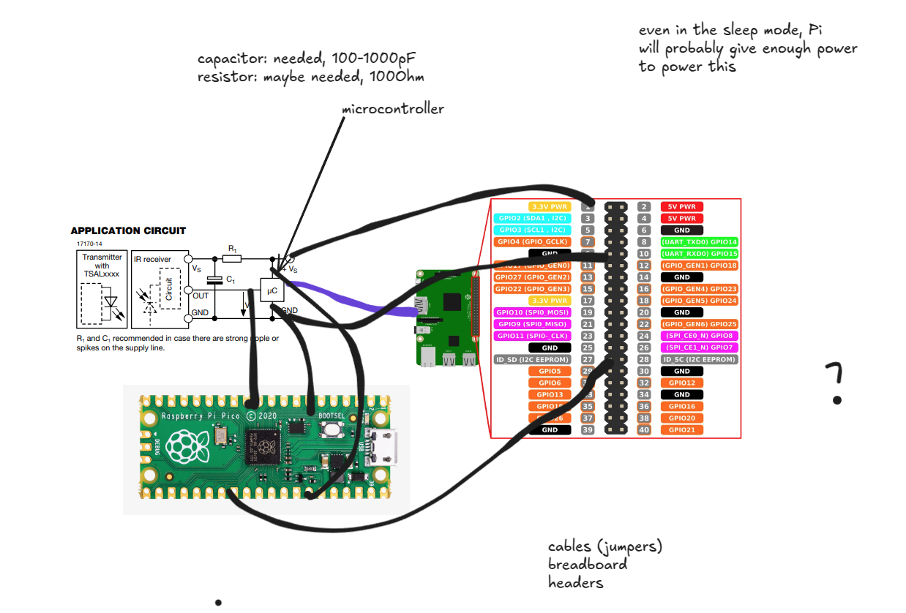{width=90%}](../images/electronics/diagram.png)
<figcaption>First version of the diagram
</figcaption>
</figure>

The idea was to connect a [Raspberry Pi Pico](https://www.raspberrypi.com/products/raspberry-pi-pico/), a microcontroller, to my RPi5 pins: even when the RPi is turned off, it gives a small amount of current (at either 5 or 3.3V that pico needs) via its pins when connected to the mains that should be enough to power pico.

Then, there would be an infrared (IR) receiver whose datasheet describes how to connect it to the microcontroller (µC): it has 3 legs: two ($V_s$, GND) for the current to flow and another one (OUT) to mark whenever it detected the infrared light[^3] of a given frequency. I found online that the frequency typically used in Samsung TVs is 38kHz.

[^3]: Actually, the sensor I bought was giving out power (1) when there was no signal and 0 when there was one.

The plan was to process the OUT signal on the pico and then send the signal to one of the RPi pins that would wake it up.

## Components

Apart from the components mentioned above, as per the datasheet, I needed a resistor and a capacitor to smooth the flowing electric signal.

Furthermore, I needed some cables[^4] to connect things together and [a breadboard](https://en.wikipedia.org/wiki/Breadboard) to make them easier to connect.

[^4]: the ones with convenient connections for electronics projects are called [jumpers](https://en.wikipedia.org/wiki/Jump_wire)

As the delivery cost for small orders was prohibitive, I decided to get a couple of random maybe-useful-in-the-future components:

1. instead of buying just one resistor (of I'm-not-yet-sure resistance) and capacitor, I bought two "booklets" with a number of resistors and capacitors of varying resistances/capacitances.
2. I got a multimeter to see when the current is flowing.
3. I ordered a bag of random diodes to be able to visualize things and another one with buttons.

<figure>
[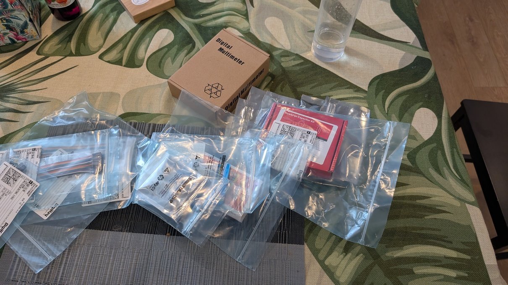{width=100%}](../images/electronics/my_order.jpg)
<figcaption>Picture of the components in my order
</figcaption>
</figure>

All together, this cost slightly above $60.

## Circuit simulation

Before connecting real components, I played with [circuitjs](https://www.falstad.com/circuit/circuitjs.html) to revise how the way the components are connected influences the current, voltage, and resistance.

{width=60%}

As the first subproject, I wanted to connect a diode. I read somewhere the required level of current so that it doesn't burn and decided to calculate the necessary resistance.

My naive understanding of [Ohm's law](https://en.wikipedia.org/wiki/Ohm%27s_law) was that resistance is the inherent property of the diode, so I should be able to use the diode's forward voltage (2V) and required current (20mA) to calculate the total resistance in the circuit: 2/0.02 = 100Ω. I will then subtract the internal resistance of the diode to get to know how much extra resistance I need to place in the circuit.

I've already reached the limits of my understanding here, as it turned out diodes don't behave like the other components that have a fixed resistance but rather their resistance changes non-linearly with voltage.

{width=80%}

Thus, I have played with the diode model in circuitjs and ended up using 100Ω as an upper bound of what I might need.

<figure>
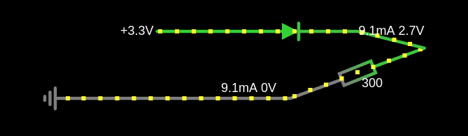{width=60%}
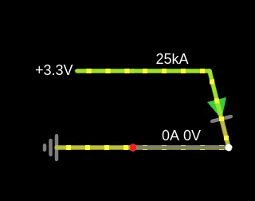{width=60%}
<figcaption>
Some of the circuits I drew: I tried to see how circuitjs handles connecting power with ground directly (short-circuit).
</figcaption>
</figure>

## Plan

As the main purpose of the project was to learn something new as opposed to getting to a working product quickly, I split it into stages to structure my learning. The steps were:

1. to be able to upload and run any program to the Pico microcontroller
2. blink an external LED with pico
3. receive the IR signal and blink with the LED when it happens
4. turn the RPi on with a button connected to the Pico
5. same as above but with turning on the IR signal (not button)
6. same as above but with pico powered directly through RPi

<details>
<summary>
Videos showing the intermediate status of the project.
</summary>
<figure>
<video width="500" controls loop muted>
  <source src="/images/electronics/phase1.mp4" type="video/mp4">
Your browser does not support the video tag.
</video>
<figcaption>
Running a simple program: blinking a built-in LED.
</figcaption>
</figure>
<figure>
<video width="500" controls loop muted>
  <source src="/images/electronics/phase2.mp4" type="video/mp4">
Your browser does not support the video tag.
</video>
<figcaption>
Very simple circuit with an external LED and a (100Ω) resistor.
</figcaption>
</figure>
<figure>
<video width="500" controls loop muted>
  <source src="/images/electronics/phase3.mp4" type="video/mp4">
Your browser does not support the video tag.
</video>
<figcaption>
An attempt to blink an LED on the IR signal. Unfortunately, the signal was very fast and the communication with the smart remote switched between IR and something else (see [Two TV remotes](#two-tv-remotes)).
</figcaption>
</figure>
<figure>
<video width="500" controls loop muted>
  <source src="/images/electronics/phase4.mp4" type="video/mp4">
Your browser does not support the video tag.
</video>
<figcaption>
Turning the RPi from Pico on the button press.
</figcaption>
</figure>
<figure>
<video width="500" controls loop muted>
  <source src="/images/electronics/phase5.mp4" type="video/mp4">
Your browser does not support the video tag.
</video>
<figcaption>
Turning the RPi from pico on IR signal.
</figcaption>
</figure>
<figure>
<video width="500" controls loop muted>
  <source src="/images/electronics/working.mp4" type="video/mp4">
Your browser does not support the video tag.
</video>
<figcaption>
Final, working version.
</figcaption>
</figure>
</details>

Below, I mention a couple of lessons learned while doing the project.

## Connecting the pico to the computer

RPi Pico has great documentation and [a tutorial](https://projects.raspberrypi.org/en/projects/getting-started-with-the-pico) online to get one started.

It uses [micropython](https://micropython.org/): a small python implementation that can be put on a microcontroller. It even supports REPL which makes debugging a much nicer experience. The tutorial shows how to use [Thonny](https://thonny.org/), a simple IDE, to write code and upload it to pico.

As I wanted to understand the communication with the computer at a slightly lower level, I followed a [micropython guide](https://datasheets.raspberrypi.com/pico/raspberry-pi-pico-python-sdk.pdf) instead that allowed me to interact with the pico from the commandline.

The first step to do this, I needed to give my user permission to access the serial port over which Pico would be communicating:

```bash
sudo usermod -a -G dialout $USER
```

Then, after installing micropython's dependencies (in particular I needed to install a compiler for the ARM architecture: the pico microcontroller is not using x86 that's typical in a computer), I was able to compile the interpreter (written in C) to a binary `uf2` file that can be uploaded to pico.

To do this, I needed to connect it via the USB while pressing a BOOTSEL button on the pico which puts it into flashing mode, when you can just copy a new program (firmware) for the pico to run. In my case, this program was the micropython interpreter itself.

Once finished, I was able to connect to Pico via:

```bash
minicom -D /dev/ttyACM0
```

This gave me access to the REPL with micropython to explore its interface. To store the program on Pico, I used [ampy](https://pypi.org/project/adafruit-ampy/) tool: just copying a file named `main.py` makes it execute at boot. I also copied a py file with [picozero](https://picozero.readthedocs.io/en/latest/api.html) convenience library.

## GPIO communication

Both full RPi computers like RPi5 and the microcontroller pico have a double row of pins[^5] to communicate with the external world by sending and reading electric signals.

Different pins have different purposes: they are described in a diagram called _pinout_.

<figure>
[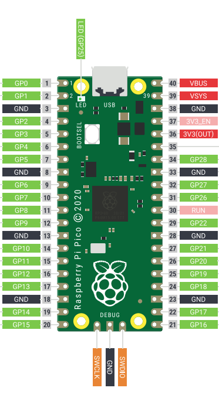{width=40%}](../images/electronics/pico_pinout.png)
<figcaption>
Pinout of the Raspberry Pi Pico
</figcaption>
</figure>

Most of the pins are GPIO (General-Purpose Input/Output): general pins that can be set in either input (reading the electric signal) or output modes (sending it). Others have roles like ground: for completing the circuit or power that I was using on the RPi to give electricity to run the Pico.

[^5]: in Pico, they can be either holes for easy soldering or a _header_ with pins for connecting to cables.

## Writing programs

My initial plan for the program to wake the RPi using IR was to:
- connect the power of the IR receiver to one of the GPIO pins
- connect the signal from the receiver to another pin
- repeatedly listen to the signal there
- when the signal is there, send an electric signal to yet another pin that would be connected to the RPi's wake-up pin

The code would roughly look like this:

```python
from machine import Pin
import time

power = Pin(15, Pin.OUT)
power.on()

ir = Pin(16, Pin.IN)
turn_on = Pin(17, Pin.OUT)
while True:
  if ir.on():
	turn_on.on()
  time.sleep(0.1)
```

The first problem I encountered was that the numbers in the code correspond to the indices across the GPIO pins (and not all pins). This makes sense, as only those can be programmed but was easy to confuse given that GPIO pins are not consecutive and mapping e.g. from the physical pin 17 to its GPIO index 13 requires some care.

### Two TV remotes

Another surprising issue was related to how the TV remotes work. My TV has two remotes: a "standard" remote with 50 or so buttons, and a "smart" one which only has a couple of them and can be USB-charged. Given that the TV is only used as a monitor for the Raspberry Pi, I have only used the "smart" one so far.

{width=35%}

I thought I'd use the same smart remote for waking the pi. However, when I ran experiments to read the signals from the remote, the results seemed... nondeterministic.

After many rounds of getting confused[^6], I convinced myself that the smart remote works like this:

1. The remote can be either paired or unpaired with the TV. It will automatically get unpaired after ~10min of the TV being off.
2. The power on / power off button always sends infrared signals.
3. All the remaining buttons will send the IR signals when unpaired with the TV or communicate differently (is it Bluetooth?) when paired.
4. The remote will automatically pair with the TV when it discovers it is on.

[^6]: and confirming with Samsung support that there is no documentation whatsoever on the behavior of the smart remote that they can share

This unfortunately made the smart TV unsuitable for the task: the only button that I could reliably use was the standby one but it would also cause turning on and off the TV which was undesirable.

Because of that, I decided to dedicate the "standard" TV remote (which works as one would expect, always sending IR signals) to operating the Pi and kept using the smart one just with the TV.

### Decoding remote signal

Apart from the RPI reading the signal from the standard remote (e.g. after pressing a number or volume up; I didn't care which button would turn the TV on) I needed to make sure that the occasional turn off/on signal from the smart remote would not be interpreted by the Pi as "wake up now". Without this, the RPi would always turn on whenever I try to turn the TV off which is quite the opposite of what I wanted to achieve.

This meant, that I had to decode the signal pattern from the remote to distinguish the two remotes (and potentially different buttons, although I didn't do this).

#### Interrupt handlers

The first step to get there was with [interrupt handlers](https://docs.micropython.org/en/latest/reference/isr_rules.html): a mechanism allowing to call a piece of code whenever a signal on some pin changes. The reason for this is the speed at which the IR signal is being sent from the remote: when reading the signal every 100ms, I was sometimes missing the signal due to sleeping when it was being received.

The IRQs (interrupt requests) allow to immediately execute the code without the need for active waiting, eg.:
```python
ir = Pin(16, Pin.IN)
def receive(p):
  print("pin", p, "is now set to", p.value())

ir.irq(receive, Pin.IRQ_FALLING | Pin.IRQ_RISING)
```

I implemented a short piece of code there that printed the value (0 or 1) of the signal that just finished and its duration.

It turned out that the signal from the remote is encoded in the following way:

1. the "on" signals are separated with short pauses of length ~500µs
2. the signals are either long (~1.5ms) or short (0.5ms)
3. a single button press corresponds to a sequence of 32 bits
4. the first half, 16 bits, is the same for each of the remotes (and different between the remotes). It was `1111000001110000` for the regular remote, where 1 is the long signal.

Note that the signals are orders of magnitude shorter than I expected by waiting 0.1s: they were impossible to decode earlier.

<figure>
[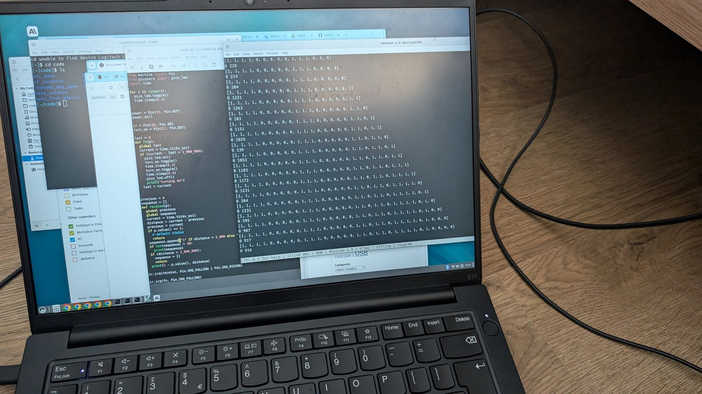{width=100%}](../images/electronics/decoding_signal.jpg)
<figcaption>Trying to understand the remote signal
</figcaption>
</figure>

Decoding the signal allowed checking whether it comes from the standard remote and only sending the wake-up signal then. I also added a diode blink for easier debugging. The final code is here:

<figure>
```python
from machine import Pin
from picozero import pico_led
import time

for i in range(4):
  pico_led.toggle()
  time.sleep(0.2)


power = Pin(15, Pin.OUT)
power.on()

ir = Pin(16, Pin.IN)
turn_on = Pin(17, Pin.OUT)


def turn_me_on():
  pico_led.on()
  turn_on.toggle()
  time.sleep(0.1)
  turn_on.toggle()
  time.sleep(0.4)
  pico_led.off()
  print("turn on")


previous = 0
sequence = []
def receive(p):
  global previous
  global sequence
  current = time.ticks_us()
  distance = current - previous
  previous = current
  if p.value() == 1:
    # default status
    return
  sequence.append("1" if distance > 1_000 else "0")
  wanted = "11110000011100000"
  if len(sequence) == 32:
    prefix = "".join(sequence[:len(wanted)])
    if prefix == wanted:
      turn_me_on()
  if (distance > 1_000_000):
    sequence = []
    return

ir.irq(receive, Pin.IRQ_FALLING | Pin.IRQ_RISING)
```
</figure>

### Wake on GPIO 3

The final problem I encountered was how to actually wake up the Raspberry Pi using the electric signal. 

Some of the documentation that I found on the internet says that just sending any signal to GPIO 3 should wake the pi from sleep but it was not working for me. I read a lot of forum pages where the opinions on whether it should work were divided.

I also spent a lot of time with chatGPT who was proposing different ways to make it work, but none of them did in the end.

My understanding is that something has changed in the design of RPis between version 4 and 5 that made waking on GPIO either impossible or required some more changes on the firmware side that I didn't manage to discover.

Luckily, a different mechanism for powering on RPI was introduced: a [J2 jumper](
https://www.raspberrypi.com/documentation/computers/raspberry-pi.html#add-your-own-power-button): a two metallic holes, such that if you connect them with a wire, the rpi will turn on.

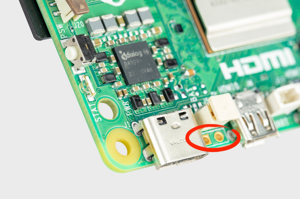{width=70%}

Using this mechanism posed two problems:

1. how to physically connect the two holes
2. how to do it based on the IR signal

The standard solution for using this type of connection would be to solder two wires to it, but I didn't want to learn to solder, especially at such a difficult place (the holes are quite difficult to access).

As the holes were only slightly bigger than the width of my jumper cables, to keep them in place I decided to bend the cables using pliers and insert them in. Of course, this is not as sturdy as soldering them in but feels ok as long as the RPi stays in the case.

<figure>
[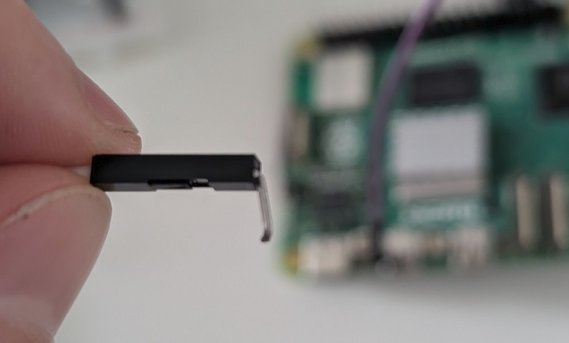{width=40%}](../images/electronics/bent_connection.jpg)
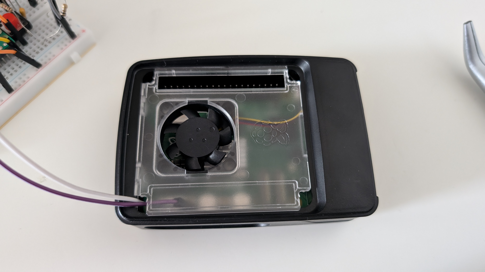{width=43%}
<figcaption>
A jumper cable, bent to encourage it to stay in place in the j2 connection (left) and the placed cables leaving the case (right).
</figcaption>
</figure>

### Shorting two cables on the electric signal

So, how do you go about shorting two cables when there is an electric signal? As I have learned, this is what you use [transistors](https://en.wikipedia.org/wiki/Transistor) for.

After chatting with Claude about which transistor to use, I went for [2N7000](https://en.wikipedia.org/wiki/2N7000), bought for a whooping price of £0.29. I also learned about [CPC Farnell](https://cpc.farnell.com/) electronics shop that has a bit more friendly delivery costs for small orders.

The diagram for connecting the transistor looked like this:

<figure>

[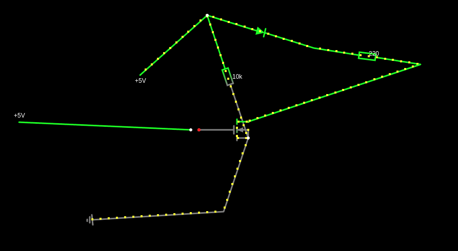{width=90%}](../images/electronics/transistor_diagram.png)
<figcaption>
A circuit using a transistor.
</figcaption>
</figure>

The seemingly unnecessary connections with the resistors were needed as the transistor behaves like a capacitor and, with no grounding would keep shorting the connections even after the signal is off:

<figure>
<video width="49%" controls loop muted>
  <source src="/images/electronics/transistor_on.mp4" type="video/mp4">
Your browser does not support the video tag.
</video>
<video width="49%" controls loop muted>
  <source src="/images/electronics/transistor_off.mp4" type="video/mp4">
Your browser does not support the video tag.
</video>
<figcaption>
Turning a diode on via a transistor based on a signal from a button. Without a pull-down resistor (left) and with one (right).
</figcaption>
</figure>


## On using multimeter

When working on this project, there were a number of occasions when I wanted to double-check whether the power flows in a given circuit:

- when I tried using the pin numbers instead of GPIO numbers to control them,
- when the signal from the remote seemed non-deterministic
- when sending the power to GPIO 3 didn't turn the Pi on

In these situations, the multimeter turned out to be invaluable: debugging with diodes was more error-prone. 

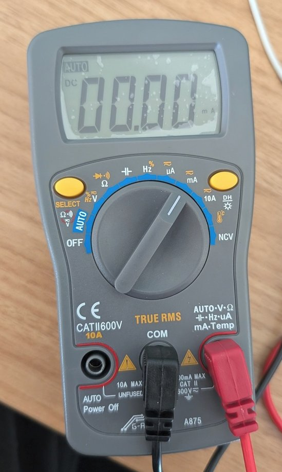{width=50%}

On the surface, the operation of the multimeter seems simple: you connect a red hand to the power in your circuit and a black one to the ground and it tells you the current/voltage flowing.

However, there were still a couple of lessons to learn to use it correctly:

1. when breaking the circuit and connecting the multimeter, I need to use it in the current (mA) mode, not voltage (which is not constant in the serial circuit and would likely require the multimeter to try to put as much voltage as possible through the circuit which might fry things there)
2. there are two options for connecting the red hand to the multimeter: unfused and fused. Unfused is meant to be used with bigger currents (it says 10A max) and might try to push current that's too big for my needs. In small electronics projects I should use the fused (100mA max) instead.
3. the metal ends of the multimeter are too big to be inserted in a breadboard: I created a makeshift connection to avoid having to hold these in hand (which is safe as the current is small but inconvenient).

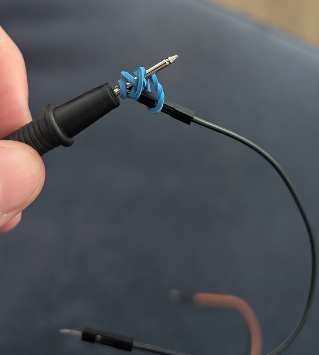{width=80%}

## Outro

Making things interact with the real world has a particular appeal. The field of electronics is vast and interesting. With my recent project, I managed to uncover a bit of the iceberg and became more comfortable the next time I wanted to build a custom circuit.
