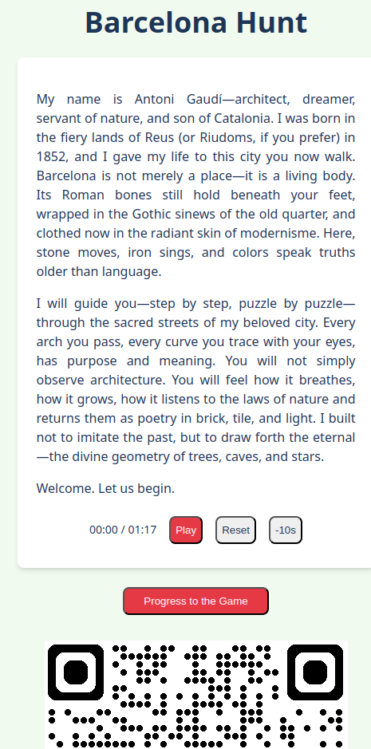

When visiting New Zealand a few years back, we stumbled upon [Urbantics](https://urbantics.co.nz/) scavenger hunt. It feels like an escape room outdoors, solving puzzles while getting to know the city's history. I enjoyed it and tried to create a [Barcelona guide](https://sygi.xyz/barcelona_guide/) in a similar format, as I'll likely be there with my parents later this year.

## Motivation

As I neither have a lot of background knowledge on the attractions in Barcelona nor want to learn it all before visiting, spoiling the fun, I decided to generate the puzzles using LLMs.

My experience using LLMs shows the best performance when using them for things that I don't know much about and relying more on knowledge (which is available on the internet) than reasoning. Creating the puzzles seems to match this description.

I wanted to make the guide in a style as if you were shown around by a famous person in the city (for Barcelona: Antoni Gaudi, an architect behind many of Barcelona's famous buildings), who would tell you their opinions about these places and allow you to ask questions.

### Technicals

There were many interesting puzzles in the Urbantics game:

- based on looking at a particular location
- using stickers put by the employees
- with VR
- based on customs recordings,
- etc.

For my guide, to avoid scope creep, my plan was to:

1. choose a number of landmarks in the city
2. show the next location on the map, and once the player is there, show a puzzle related to this place
3. once a puzzle is solved, play some explanation by the virtual Gaudi and progress to the following puzzle.

## Generating puzzles
The main difficulty was generating the puzzles and the explanations in the appropriate style. I started with this as decided that even if I don't do anything else, this will be valuable on its own.

### Puzzle interface

The final puzzles were meant to be stored in a structured format. I decided on something simple like:

<pre class="sourceCode">
id: 10
title: Casa Vicens
location:
  lat: 41.4036
  lon: 2.1553
introduction: |
  Introduction to the puzzle
challenge:
  title:
  question: |
    Puzzle question
  answer: answer
success_text: |
  Longer explanation text
next_puzzles_id: 11
</pre>

Note: I wrote this interface and started work on the puzzles in [Lex](https://lex.page/), AI-enhanced text editor, but I didn't find it really useful, so I continued locally.

### Gaudi's speaking style
Then, I generated a summary of how Gaudi was talking, to give to the LLM for the generation of the texts/puzzles.

The style guide that I got was:

<details>
<summary>Gaudi styleguide</summary>

1. Emphasize: Nature as the ultimate teacher, the integration of structure and beauty, Catalan identity.
2. Use metaphors: Drawn from the natural world (trees, mountains, caves, skeletons, light).
3. Tone: Passionate, spiritual, visionary, perhaps a touch dogmatic or eccentric.
4. Refer to: Structural innovations (catenary arches, tilted columns), materials (stone, brick, ceramic, iron), and craft techniques (trencadís).
5. Attitude: Deep respect for nature, pride in his unique approach, dismissal of purely historical imitation, dedication to his craft and Catalonia.
	
</details>

### Narratives
I was worried that generating interesting, diverse puzzles would be difficult, so I decided to start with generating just the narratives: the texts that explain a given attraction in a particular style.

With the help of a thinking model, I came up with this prompt:

<details>
	<summary>Narrative-generation prompt</summary>

```text
You are GaudíMind, channeling the visionary spirit of Antoni Gaudí.

Task: Write 10–15 concise attraction/landmark explanations—each
meant to appear immediately after a puzzle is solved. Do not generate
full puzzles; only the narrative explanations.

Constraints:

1. Geography: Each location must be within a 500–800 m walk of the
   previous one (assume an existing route).
2. Accessibility: All stops (except Park Güell) are freely visible
   from the street—no ticket required.
3. Length: Aim for 100–150 words per explanation.
4. “Gaudí Monologue” Style (as above)

Output:
For each stop, provide:

1. Name of the landmark
2. Brief narrative (200–300 words) in Gaudí’s voice

Example:
Name: Passion Façade in Sagrada Família
(example, high-quality narrative generated by another model)
```

</details>

I used this prompt with chat GPT's deep thinking model, hoping that it's ability to spend a bit more time thinking and browsing the web will make the texts more likely to be factual.

Unfortunately, the answers I received were in character too much: they spoke very poetically about the buildings but without much information, needed for the guide.

I asked the model to revise it, in order to include more information, with great results, despite the fact that the new generation was not running with enhanced thinking time like the original one.

<details><summary>Example narrative</summary>
<pre class="sourceCode">
In 1900, Count Eusebi Güell asked me to design a private residential
garden city atop Carmel Hill. The venture failed—but what a failure!

We built only a few homes, but the infrastructure—the real dream—remains.
Stone viaducts curl like roots across the slope. A forest of tilted Doric
columns holds up the plaza above, their angles based on gravity itself.
The serpentine bench? It flows like a river, clad in trencadís mosaic from
broken tiles and recycled glass. Even the drainage systems are part of
the design. In 1926, the city made it public.

Today, you enter through the monumental staircase and see my mosaic
salamander—perhaps a dragon. Park Güell is a spiritual playground:
architecture, nature, and joy fused under the Catalan sun.
</pre>
</details>

### Generating the puzzles
Once I had the narratives, it was time to generate the associated puzzles. I didn't want/hope for them to be too involved: I was planning to get simple text questions and slightly modify the narrative to include a natural-language explanation of the answer.

Still, the puzzles generated by 4o were quite low-quality: initially, I was only getting questions in the style of "count the number of X" and a simple modification of the narrative: "when you counted X...". When I asked it to be more creative, I got a puzzle that I wasn't able to verify, making me suspect that it started to hallucinate.

To resolve this, I changed the models to Gemini 2.5 whose puzzles looked better.

### Verifying the puzzles

The narratives and the puzzles generated by the LLMs
look convincing, but one never knows if they are based
on the correct information. As it might be quite annoying to
be trying to solve a puzzle that doesn't have a solution,
I wanted to verify the puzzles somehow.

Of course, I am not able to actually go to Barcelona just to
try to solve the puzzles over there. Instead, I can
use Google Street Map to look for the features mentioned in the puzzles.
Still, I didn't want to go through each puzzle: it's often
difficult to find the precise element that they are mentioning,
and getting to read them all would kinda spoil the fun of solving
them again.

To get some confirmation that the puzzles make sense, I
generated a script that calls another llm asking the same puzzle
to see if the result was the same the second time.

I assumed that if two llms' answers match, then the puzzle is likely correct.
If it wasn't, I tried to verify the puzzle manually afterward.

I haven't kept precise statistics, but my impression was that
slightly more than half of the puzzles were correct,
around a quarter wasn't, but were solvable just by changing the answer
to the one generated by the second LLM (after confirming it),
and the remaining 2 or 3 puzzles needed a complete re-do.

## Frontend

### Ready-made solutions
At the beginning of the project, I looked online for ready-made solutions
for choosing the puzzles and displaying them on a map.

The constraints I had in mind were:

1. the system should be available online or on Android phones
2. it should be free for my occasional use
3. it should be possible to store the puzzles in some format, so
   that I can create them outside of the puzzle company ecosystem.

I looked at the following solutions:

- [Caught](https://caught.nu/): quite a nice app (this is the one used by Urbantics in Wellington),
  but not free for little traffic, and the puzzles are created on the website
- [ActionBound](https://en.actionbound.com/): looks fine, but the free games (called bounds) are public
- Tizian Zeltner's [BSc project](https://tizianzeltner.com/projects/artreasurehunt/), but it's written in Unity and I didn't like Unity last time I tried it

### Vibe-coding the app myself
Creating the frontend was my first big vibe-coding project.

Regarding tools, I decided to give the recently-announced
[Max agentic mode](https://zed.dev/agentic)[^1] of zed a try. I started by generating
documentation from a shorter prompt using a thinking model and
using it to ask a regular autoregressive model to write the website piece by piece.

[^1]: at some point, I also tried the [firebase studio](https://firebase.studio/), but
      I couldn't make it to spit out any code that would run, and
      [Jules](https://jules.google), which managed to solve a simple task but
      got stuck (ie. kept spinning for hours) as soon as I asked for something
      more useful, likely due to heavy usage when I was trying it out.

The model decided on using React + Vite (whatever that is). One difficulty
I had to tackle at the beginning was the model being very eager
to try to generate everything[^2] in the first run (despite me asking
for very directed, concrete changes), what invariantly led to getting
an error somewhere that was difficult to fix given the amount of
code to sift through.

[^2]: and more! When reading through the code later, I found
      parts related to handling hints or calculating points, which
      were neither a part of my original prompt nor the generated
      documentation.

Despite those struggles, overall, the model was making reasonable progress.
Of course, there were moments when I needed to take the steering wheel
but for many things (eg. playing audio, showing old pins on the map, triggering
a puzzle when within a fixed distance from its location), the generated code "just worked".

At one point, after maybe half a day of coding, I was out of the tokens
for the free Zed trial: I decided to continue using the free tier of Gemini Flash 2.5 Preview with
an API key. I found the model to require a little bit more steering than Claude which
I used before but still was very useful. The free tier there is quite generous:
when making repeated requests with a lot of contexts, I would sometimes get a message to
wait for a couple of seconds, but my usages were only reaching 20% or so of the daily quota.

{width=60%}

Overall, it took 2 days / ~15 hours to get the frontend to an acceptable state.
I served the website using Github Pages as a subpage on my blog, which was quite
effortless.

### Generating audio

Oftentimes, when playing games with a lot of narrative,
I find reading the texts tiresome: I prefer when, at least some
of them, are voice acted[^3].

[^3]: one game where this was particularly annoying for me was [Disco Elysium](https://store.steampowered.com/app/632470/Disco_Elysium__The_Final_Cut/)

Because of this, I also wanted it to be possible to play the audio of the narratives in
my scavenger hunt game. I also thought that choosing a voice
that would match the seemingly excited, artistry speaking style
of Gaudi would match the topic.

Initially, I also looked at the possibility of copying Gaudi's
voice outright, but, having died at the beginning of XX-th century,
there is no known recording with his original voice.

For generating the audio, I used [text-to-speech from Google Cloud](https://cloud.google.com/text-to-speech?hl=en).
They offer generation for the first 1M characters/month for free
which is more than enough for my use-case[^4].

I played a bit with choosing the voice, format (it seems PCM / uncompressed sounds quite a bit
better than MP3), and the speed of talking (high information density speech
of a guide calls for slower than usual talk).

Initially, I was planning to use a ["studio" voice](https://cloud.google.com/text-to-speech/docs/list-voices-and-types#studio_voices), but then I settled on
Rasalgethi, due to its availability for [Live API](https://ai.google.dev/gemini-api/docs/live) in LLMs, keeping the
door open if I decide later to add a possibility to ask questions
to the virtual Gaudi. Surprisingly, even though there were hundreds of voices
in tens of languages, there were no English voices supporting a Spanish-style accent.

[^4]: Total number of characters in my narratives (apart from puzzle questions) was 13417.

The audio excerpts were generated using a simple bash script that reads the yaml with the puzzle
and sends the request to GCP using curl.

<details>
  <summary>The script</summary>
    
 ```bash
 for i in `seq 1 15; do \
 curl -X POST -H "Content-Type: application/json" \
-H "X-Goog-User-Project: ..." \
-H "Authorization: Bearer "..." \
--data @- "https://texttospeech.googleapis.com/v1/text:synthesize" <<EOF | jq -r '.audioContent' | base64 --decode > puzzle${{i}}_success.mp3
pipe pipe heredoc> {
pipe pipe heredoc> "input": {
  "text": "$(yq '.success_text' ../puzzles2/${{i}}_*.yaml)"
},
"voice": {
  "languageCode": "en-GB",
  "name": "en-GB-Chirp3-Rasalgethi",
  "voiceClone": {
  }
},
"audioConfig": {
  "audioEncoding": "LINEAR16",
  "speakingRate": 0.82,
  "sampleRateHertz": 48000
}
}
EOF; done
```
</details>

<figure>
<audio controls src="../data/gaudi/example_narrative.wav">Your browser does not support the <code>audio</code> element. </audio>

<figcaption>Example generated audio narrative.</figcaption>
</figure>


### Spoofing GPS

To test the GPS-related features, I tried using GPS spoofing. Unfortunately,
the [GPS spoofing extension](https://chromewebstore.google.com/detail/spoof-geolocation/ihdobppgelceaoeojmhpmbnaljhhmhlc?hl=en) in Chrome was only updating the location at the
refresh of the page, so it wasn't clear if the map updates correctly.

I wasn't sure if the lack of location updates was a problem with the extension
or my app. Because of that, I decided to see if I have the same issue on mobile.

To do this, I needed to resolve two problems:

1. by default node/react only serves the app locally (`npm dev -- --host` fixes this)
2. the location features don't work on non-encrypted (http-without-s) websites at all

I solved the second problem using ngrok, who provide ddns services:
you run a program and they give you a long link which is forwarded to some port on your computer.

The GPS spoofing on mobile also wasn't perfect, as it was switching between Barcelona and London
every couple of seconds, presumably as it was getting conflicting information from the spoofed
GPS signal and other sources like WiFi. However, even with this inconvenience, I was able to confirm
that the location updates and that the puzzles trigger as they should.

## Outro

I am not planning on actively working on the guide in the near future.
While the frontend is feature-poor, a simple game can be run there, and
it shouldn't be difficult to extend it with more types of puzzles if needed.

Two related points that I'd like to see improved are:

1. automate the process of generating the problems/audio more, so that one
   can click any city on the map and get a game generated on the fly
2. some of the puzzles themselves feel a bit generic, and still required
   a bit of manual fact-checking to be correct.

I am quite happy with the state of the guide, especially given the amount of time
it took to get there. I'm looking forward to battle-testing it once I actually go there!
