Jane Street is a hedge fund with a strong puzzle culture. They have published a math/computing puzzle every month since 2014. Anyone can submit a solution, and each month's puzzle page lists the people who solved it.

Over the last year, I attempted to solve the puzzle every month. In this post, I describe my experience solving them.

## December 2024: board game night
The December 2024 was a good entry drug for the Jane Street puzzles: a relatively simple single photo one. Pieces from different board games were scattered across the table, and for each game one element was missing.

Once you arranged the missing elements in the same order as the game boxes and took the first letter from each (e.g. “Y” for yellow cards missing from Uno), the letters spelled “you sank my”

After checking online, I learnt that it completes with “battleship”.
<figure>
[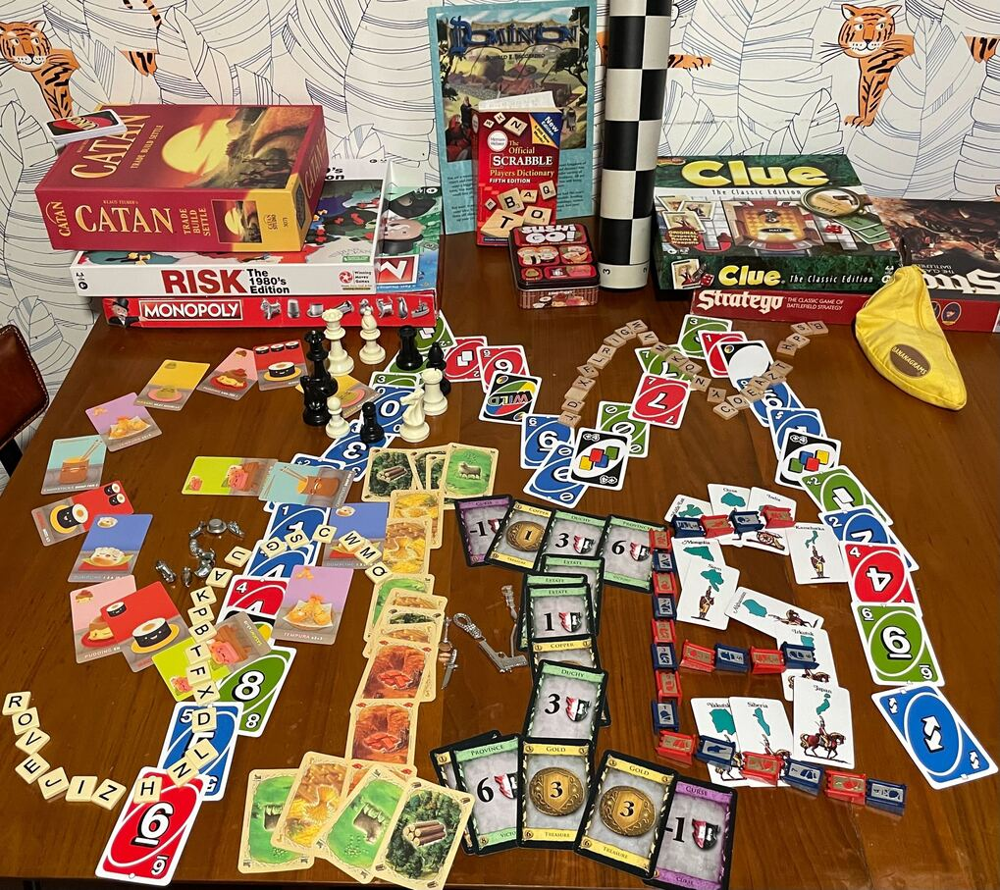{width=80%}](../images/jane-street/dec24-puzzle.jpg)
<figcaption>
Photo of the December 2024 puzzle.
</figcaption>
</figure>

## January: GCD sudoku
This puzzle involved solving a sudoku in such a way as to find the solution that maximizes the joint greatest common divisor of all the rows.

This was the first time I was solving such a compute-intensive puzzle. I spent a lot of time analyzing the problem (e.g. the GCD divides all the rows and some rows end with 5 or 0, so the GCD has to be divisible by 5). I wrote a backtracking search over sudoku solutions and added many optimizations to keep it from being terribly slow.

For example, I used [tries](https://en.wikipedia.org/wiki/Trie) to track eligible prefixes: after combining many low-level observations and partial searches, I was able to construct a trie that cut off many ineligible branches.

When I found the solution, I was truly in awe of the puzzle setters: there were many common divisors below some threshold, then roughly an order of magnitude gap with no solutions, and finally a single solution with the largest common divisor.

Designing puzzles like this seems genuinely difficult.

## February: one in one out
This was a language puzzle where there were two columns of words in two colors, and you were asked to extract a meaning from them.

Despite processing them in many different ways, I didn't get far with this one: the final solution relied on removing one letter from "red" words and scrambling them to create the "blue" words.

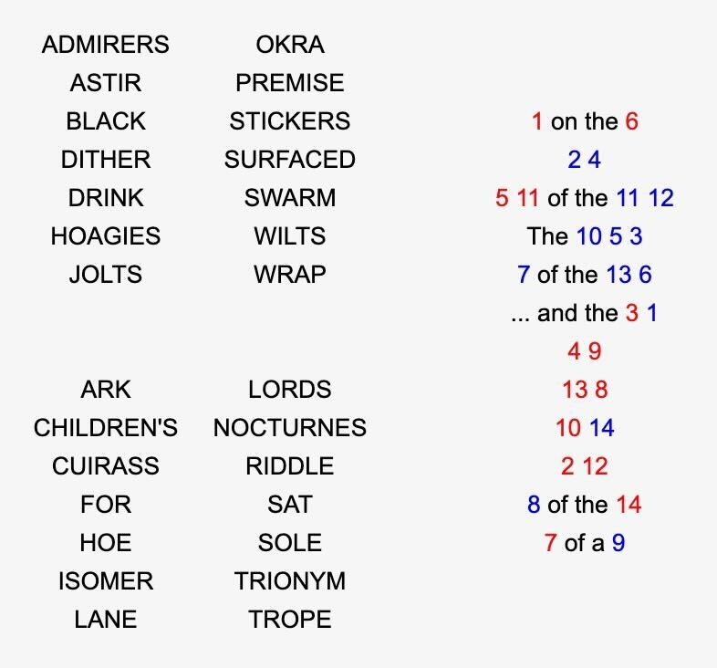{width=60%}

## March: Hall of Mirrors 3
This was one of the grid problems, where you place mirrors so that when you multiply the distances the rays travel between reflections, they have to match.

I solved it similarly to January one, by implementing the search in Python. It worked surprisingly easily: I didn't need to tune the search too much to make it work fast enough.

## April: Sum One, Somewhere

This was a simple math puzzle:

> For an infinite binary tree where each node has either a 0 or a 1 with probability p (independently), for what p there is 1/2 probability that there exists an infinite path down that sums to 0 or 1?

To do this, I wrote a simple recursion formula, which gave me a degree-3 polynomial that I solved with Wolfram Alpha.

## May: Number Cross 5

This was another grid puzzle where every cell was either a digit from 1-9 or a blank. Blanks separate numbers from each other and the resulting numbers have to follow the clue for a given row.

I started solving this puzzle in the same way as I did for March and January: by writing Python search code.

However, this proved too slow, so I searched online how people are solving these types of puzzles and discovered [ortools](https://github.com/google/or-tools): a tool for solving integer combinatorial problems in Python[^1].

[^1]: with C++ backend for speed

### Ortools

It took me a while to get used to the mental model of ortools.

It assumes that you don't program imperatively; instead, you create many variables over subsets of integers.

Then you add constraints and relations between the variables, and the solver iterates over all the possible values of the variables, looking for solutions (or trying to find the best solution).

The programming interface in ortools wasn't great. For example, many functions (for example adding an implication P -> some conditions) required that its input (here: P) is a raw variable (`P = model.new_bool_variable`) and not an expression (`P = one_var == another_var`).

Once I knew this, it was possible to circumvent: every time you need an implication from an expression `E`, you can create a dummy variable `B` with constraints `B->E` and `~B->not E`, but having to do so manually felt wrong.

Similarly, there was no simple "and/or of two binary variables" utility: I ended up creating some of these helpers and then copying them around whenever I used ortools.

#### Formulation tightening

Another difficulty when using ortools was making sure to not iterate over effectively identical solutions.

It is often convenient to programmatically create a lot of variables for a given problem.

For example, in one of the puzzles, I had a variable `in_grid{x}_{y}` for each cell indicating whether it's full, and another `distance{x}_{y}` for the distance to the nearest empty cell.

As long as the number of variables is up to 10^6 -- 10^7, ortools is very efficient in cutting the search branches out to find the solution. This works nicely when one wants to find any solution, but becomes tricky when finding all of them is needed.

The second case was rarely technically necessary for me, but in practice I needed it to make sure I didn't make a mistake on the way: if there is a lot of similar solutions when I expect one, it's often a sign something went wrong.

The extra variables that are added in the process of defining the problem are often only relevant under some constraint, i.e.:
```
model.add(cell[y][x] == distance[y][x]).only_enforce_if(in_grid[y][x])
```

In the case above, when `in_grid` is chosen false for some cell, there is no constraint on distance and it can choose an arbitrary value. From the point of view of the puzzle solution it doesn't matter: for the empty grids, the distance wasn't defined.

However, from the point of view of ortools solver, once getting in a state where it can choose any distance value, it would iterate over them, often spitting millions solutions that are identical to the person solving the puzzle.

Even just printing them is often infeasible, so to be able to efficiently iterate over all solutions, one needs to add extra "dummy" constraints that fix the value of the variables in the cases where their value is not relevant, e.g.:
```
model.add(distance[y][x]==0).only_enforce_if(in_grid[y][x].Not())
```

Of course, this sounds easy in the simple example above, but fully tightening the formulation so that every variable has only a single reasonable value often requires work and is quite tedious.

Coming back to May puzzle, once I rewrote the optimization in ortools, it sped up about 1000x, letting me find a solution quickly.

## June: Some Ones, somewhere

This was a fun puzzle, with no explanation whatsoever, just a picture:

<figure>
[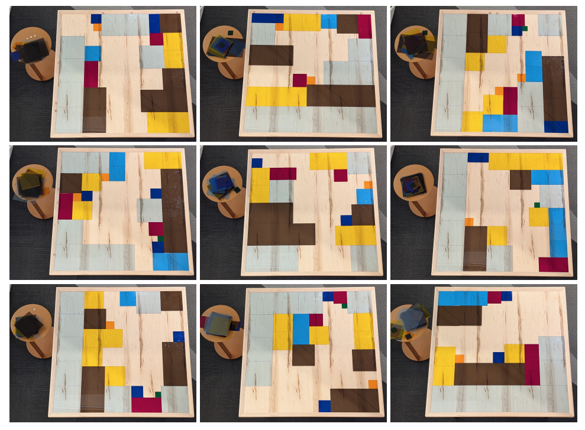{width=90%}](https://www.janestreet.com/static/pdfs/puzzles/june-2025-puzzle.pdf)
<figcaption>
June puzzle
</figcaption>
</figure>

Initially, I realized that color determines each square's size, so I started by estimating the sizes of the pieces of each color by writing some equalities in ortools.

As there are some additional tiles on tables on the side, I spent a lot of time trying to count the tiles on the side table. They were barely possible to be counted; sometimes not all the colors are visible, but you can try to match the corners with each other.

I then started to count the total area covered by the tiles. For some of them,
the area would be all of it minus one (ie 2024, as the boards are 45x45 = 2025).

I wrote the code to estimate how the boards could be arranged. For the one with the single empty field, there was only one solution, so I thought I might be on the right track.

I then realized that the total number of size-two ("green") tiles on each board was at most 2,
the total number of size-three tiles at most three, etc.

When I looked at the distribution of tiles for the nearly full board, I actually got exactly:
two of size 2, three of size 3, etc.. (2^3 + 3^3 + 4^3 + 5^3 + 6^3 + 7^3 + 8^3 + 9^3 = 2024).

I thought that maybe, all the boards were meant to be nearly fully (2024/2025) covered: this wouldn't match my counts of the side tiles, but maybe I wasn't counting the side tiles correctly.

I started writing down the settings of the placed tiles and run the program to find the empty field assuming that
I'll use the same number of the tiles (2 twos, 3 threes, ...).

It turned out that I was getting unique solutions, which made me realize what I'm doing is right.

I still needed to find a way to map the solution to the sentence, as the puzzle was stating.

There were scrabble tiles on the border of the boards; after a bit of thinking I realized they match the regular latin/ascii order, repeated over 3 * 45 places (first column: A, second B, ... etc)

I tried to map each (1/2025) "hole" into two letters but it didn't lead to an intelligible text:
```
(the) usomcfbusesisauqrae
```
This didn't mean much to me; I was planning to try out some statistical tests over this text, but then I realized
that by changing the order of letters in each pair (first the letter corresponding to x coordinate, then y one),
I got:
the sum_of_cubes_is_a_square

which made sense and perfectly matched the puzzle

<figure>
[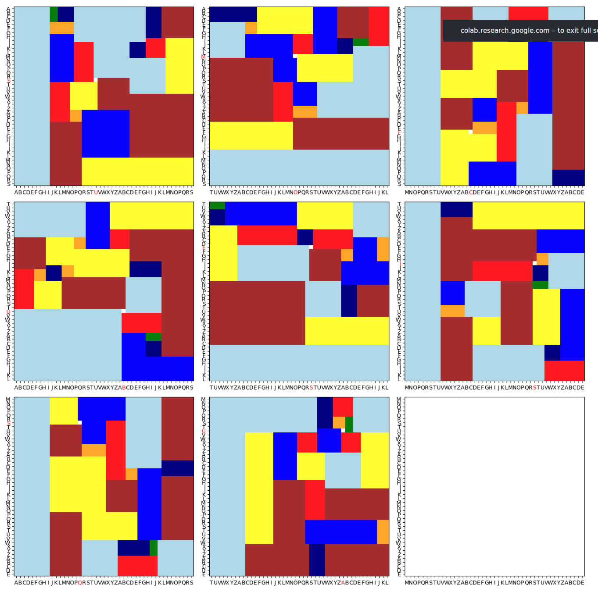{width=80%}](../images/jane-street/jun-solved-boards.png)
<figcaption>
The picture of the solved boards of the June puzzle.
</figcaption>
</figure>

This is probably my favourite puzzle from the year: it had several stages and lots of dead ends for me
but in the end, the solution is pretty simple and shows an elegant mathematical property.

## July: Robot Road Trip

July puzzle was a math-heavy puzzle, of the type I hoped to see a lot in here: it involves a simple but clearly-stated mathematical problem to solve.

> Assume an infinite highway with two lanes. One lane requires driving with speed at least a, the other one at most a. There is a constant stream of vehicles appearing randomly with "natural" speed from v~U[1,2] at the right lane. The cars can slow down / speed up with acceleration 1/minute^2. If a faster car is approaching a slower one, the slower one needs to slow down to move to the slower lane (or to 0) to be overtaken.
> 
> How to choose a to minimize the time lost on overtaking?

I spent a bit of time trying to internalize the statement and formalize the problem.

Once I got there, I had a couple of integrals to solve:

<figure>
[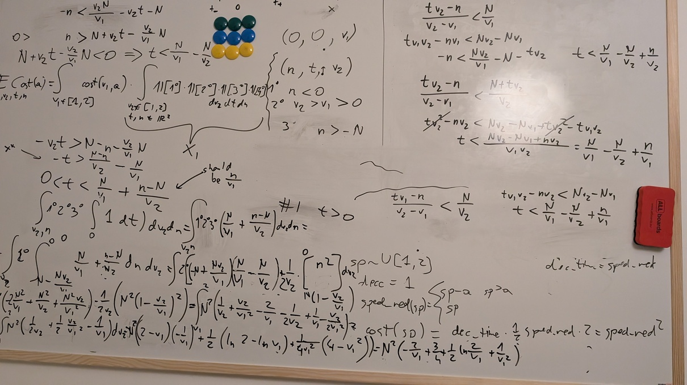{width=90%}](../images/jane-street/july-board.jpg)
<figcaption>
A photo of the board while solving the July puzzle.
</figcaption>
</figure>

The integrals themselves weren't very difficult. I managed to solve some of them on my own, but I was often making arithmetic mistakes that slowed me down.

I decided to get AI help in finishing the arithmetic calculations: I was able to get Gemini to solve the final integral of the puzzle.

## August: Dogs Playing Poker

Statement of this problem said that the dogs on the associated picture are playing poker but cannot hide their emotions and asked you to decipher the cards of one dog (the pup) based on the faces and some cards being on the table.

{width=90%}

When starting with this puzzle, I didn't know the rules of poker so I started by revising them. Then, I tried manually to attach the cards based on what I think would make sense in the circumstances. The situation was very confusing as the number of tokens didn't seem to match the rules of poker too well.

In the end, I estimated which of the faces I consider to be happy vs sad, and based on this, I ran a simulation to find a set of cards that can be in the middle so that the players would be happy or sad to some degree.
(board picture)

It was difficult to scope the search enough to have not too many solutions (for the table cards): I was either getting lots of options or nothing at all.

I then tried to add an assumption that the puzzle is solvable: so that it's possible to actually deduce the cards in the pup's hands (paws?): many of the settings were leading to conclusions that the pup can have "any low-spades card" but it was impossible to say which.

With these constraints I ended up with 4 or so options and decided to send one of them. My solution wasn't correct. Later on, I also spent a bit of time with a friend who likes card games trying to solve the puzzle again, now focusing on the sizes of the stacks on the table: trying to simulate the rounds assuming that the higher stakes leave the table later on.

None of this ended up close to the actual solution: it turned out that the game was another linguistic puzzle, where the card numbers denoted the ascii-encoded letters of the alphabet, that we were supposed to shift by the number of chips laying on them. This explains why there seemingly were multiple stacks next to some of the dogs.

Overall, the solution to this puzzle was quite disappointing.

## September: Hooks 11

The next puzzle revolved around [pentominoes](https://en.wikipedia.org/wiki/Pentomino): domino-like structures consisting of 5 squares joined together.

The puzzle defined a grid with some numbers denoting cells that are part of pentominoes.

The grid was to be divided into layered l-shaped hooks, with the number denoting the number of cells in a given hook that are part of a pentomino. There was to be a number of pentominoes in the grid, all connected to each other, and every pentomino being different from each other; pentominoes have a standardized naming scheme, independent from rotation/symmetry.

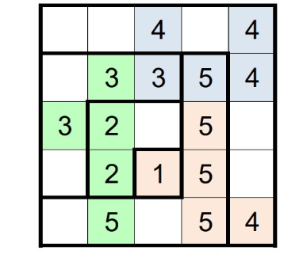{width=50%}

The solution to the puzzle was a standard application of ortools, even if it was a bit daunting to implement: luckily, AIs were quite efficient in finishing the boring parts like defining each pentomino shape.

## October: Robot Baseball

The October puzzle was a game-theoretical one where I needed to find the optimal strategy in a game.

The game itself was relatively simple, with each player having two actions available and the game having 8 or so states.

To simplify the arithmetic, I used SymPy to find the optimal action percentages in each state of the game.

Despite state and action space, the optimization was relatively slow and the results complex: even though I was running `sympy.simplify`,
the result I got was a rational function with degree 96 polynomials:

<figure>
[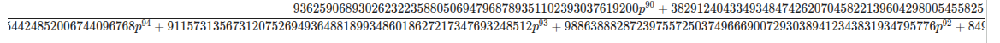{width=110%}](../images/jane-street/oct-exact.png)
<figcaption>
Exact solution to Robot Baseball puzzle.
</figcaption>
</figure>

Initially, I thought that I made a mistake somewhere or that sympy's optimization wasn't effective, as the plot of the function looked like a simple function:

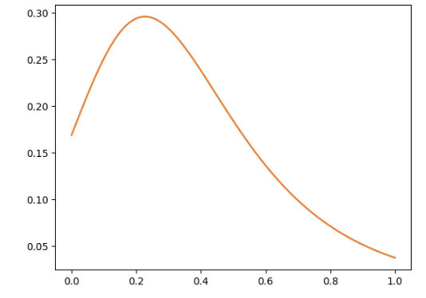{width=60%}

However, when I tried to fit a degree 5 polynomial to the function, it wasn't a perfect fit, suggesting that there is no representation simple enough that I could optimize it manually.

Because of that, I found the maximum using [ternary search](https://cp-algorithms.com/num_methods/ternary_search.html).

## November: Shut the Box

November brought another grid-style puzzle that I tried solving with ortools.

It was one of the more fun problem statements, defining a number of simple constraints to the grid but also stating that the final grid will be possible to be folded into a box.

The other constraints were simple to define, but defining the foldable constraint proved difficult. Initially, an LLM convinced me that there is a standard algorithm checking if a grid can be folded into a box by effectively "rolling" an ink-covered box over the grid and making sure that every cell of the net is covered exactly once.

However, formalizing this wasn't easy and I'm not confident that this algorithm actually exists.

While doing research, I encountered a couple of vaguely relevant papers; [one of them](https://jgaa.info/index.php/jgaa/article/download/paper520/2438/2245) showed an interesting example of a net that could be folded into boxes of 3 different shapes (in 4 ways):

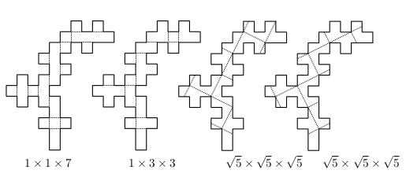{width=80%}

This didn't help me to figure out a way to automate checking whether a net is foldable, though.

An alternative strategy would be to implement only the simple constraints, find the relevant grids and fold them manually if there are not too many of them.

I tried doing this with the first net that I found but it wasn't foldable, despite me adding some "softer" constraints that are necessary but not sufficient for foldability.

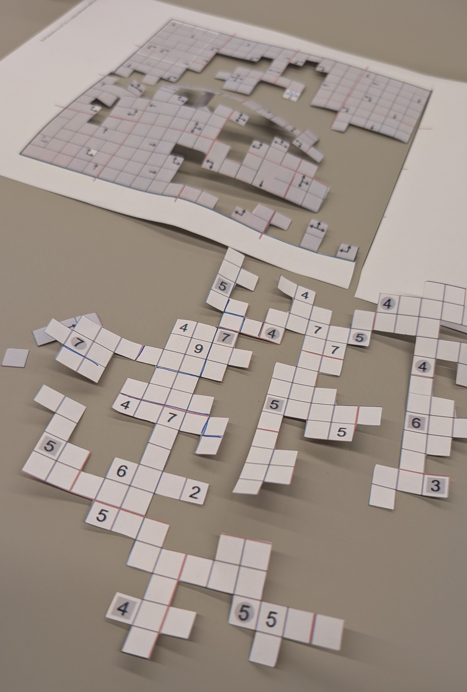{width=60%}

I didn't end up searching across all the possible nets as the manual cutting was time-consuming and I was worried that even if I spent the time to tighten the formulation to find all the solutions, there would be too many of them to efficiently check them.

### Coming back to the puzzle

As mentioned above, I didn't want to iterate over all of the solutions, so I tried formalizing the full folding constraints.

After my attempts failed, Michalina tried to help me define it in a different way. Instead of trying to state the constraint locally (the cell to the left either is in the same side or changes from bottom to the left one, etc.), she formalized it as:

1. there is a transformation matrix mapping the 2d grid positions to their 3d cells
2. we constrain the borders and the number of squares on each side of the box.

Unfortunately, defining the constraints in full there also proved difficult: my intuition is that the problematic part is that when, say, bottom side has multiple "tentacles" going left, to correctly constrain when they can be folded up:

- on one hand, if the left border of the bottom side goes along column `x`, it should be applied consistently across different rows,
- on the other, the same `x` column in the 2d grid can correspond to other sides up and down the grid which don't get folded across `x`.

In the end, we didn't end up getting to correctly constrain the solutions. I looked whether Miguel (who posts his Jane Street puzzles solutions [here](https://github.com/miguelbper/jane-street-puzzles)) managed to fully solve it but he was manually checking a couple of potential nets.

I wonder if there is a simple way to implement the foldability check in ortools.

## December: Robot Javelin

The last puzzle of the year was another game to analyze.

The game started as:

1. Each player rolls a uniform $u \equiv U[0, 1]$.
2. Each player sees their own roll result, and decides to either reroll it (in which case they have to keep the result of the second $U[0, 1]$ roll) or keep the original roll.
3. The player with the higher roll wins.

The first question was about finding a Nash equilibrium in this game.

I initially assumed that the equilibrium would simply be to reroll on $u<1/2$: as a single roll has an expected value of $1/2$, following this strategy maximizes the expected value of the throw.

However, this is not the best strategy to win the game. As the expected value of the final throw is above $1/2$ (as the players might keep the higher throws and reroll the lower ones), keeping a result only slightly above $1/2$ leads to higher chance of losing than rerolling it.

Let's calculate this exactly.

### Expected win rate

Assume that we got $u=0.5+\varepsilon$ and are deciding whether to keep or to reroll against an opponent that will keep on his first throw above $0.5+2\varepsilon$. If we keep, the expected chance of us winning is $1/4$: we will lose if the opponent keeps (above $1/2$) and if he rolls above our $1/2$ in the second throw.

Alternatively, if we start keeping for longer, we will win on $0.5-2\varepsilon$ (the opponent keeps at $1/2+2\varepsilon$) plus $1/2$ of the other case when the opponent rerolls.

There will be a point, at $(\sqrt{5}-1)/2$ where the benefits of keeping will match rerolling and the choice to keep or reroll will not make a difference in the expected win rate, i.e. a Nash equilibrium.

Intuitively, if we had not two throws but potential for, say, $10$, we don't want to keep $1/2$ from the first throw but rather to keep rolling hoping for a better score (decreasing the acceptance treshold with every throw).

### Rest of the puzzle

Once the Nash equilibrium is established, the game takes a twist. One player (`he`) has an advantage by being able to define a threshold $d$ and he gets to know if our throw was $>d$ before deciding to reroll.

This way, he gets to know if we are likely to reroll, allowing it to stay for a bit lower numbers: if he knows we are going to reroll, he doesn't need to stay at, say $0.6$: if both players reroll, his win chance is $1/2$, and $0.6$ gives them an edge.

The following question is to establish the optimal strategy for him under the assumption that we are still playing the Nash equilibrium, and then, the optimal strategy for us to counter his best-response to Nash equilibrium.

Unfortunately, I manually solved a big chunk of the second part of the puzzle under the incorrect assumption that the Nash equilibrium strategy is to reroll above $1/2$.

<figure>
[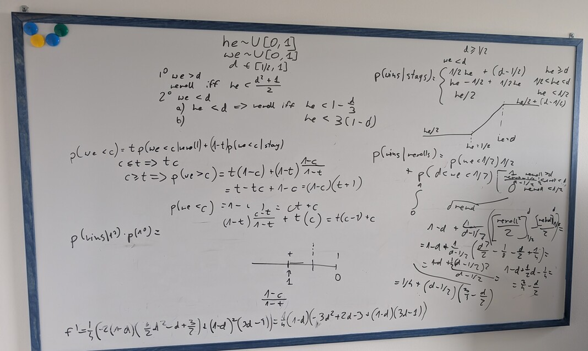{width=50%}](../images/jane-street/dec-board.jpg)
[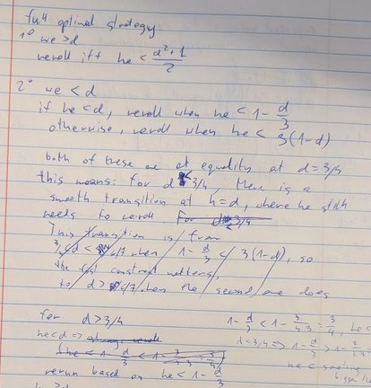{width=40%}](../images/jane-street/dec-notebook.jpg)
<figcaption>
Progress made under the incorrect assumption.
</figcaption>
</figure>

As most of my effort was spent in making simple algebraic transformations and calculating simple integrals, I went on a look out for a tool that would simplify this for me.

I started with SymPy as I had good experience with it for [Robot Baseball](#october-robot-baseball), but it was failing quite spectacularly: from needing [terrible hacks](https://stackoverflow.com/questions/48959174/assuming-a-symbol-is-between-zero-and-one-with-sympy) (that didn't work in the end anyway) to define a real number between 0 and 1, to not being able to symbolically solve a quadratic equation with coefficients 1, -1.

The next attempt was to use an LLM to calculate the integrals. Normally, Gemini is my model of choice for this type of computation, but given that it was going out of free inference quickly, I tried making some progress with ChatGPT which was surprisingly capable.

Unfortunately, both of them were making difficult to spot, arithmetic errors -- very similar to the ones that I am making myself. This makes them an ok tool for double-checking my work but not to speed up the calculation as I wasn't able to be ever confident in the outcome. More on this later.

Finally, the tool that I used for solving the problem ended up being [Wolfram Mathematica](https://www.wolfram.com/mathematica/): a system similar to Google Colab optimized for symbolic math calculation. It is relatively expensive -- in the order of $200/year for the cheapest, hobbyst version, but they have a trial version that was more than enough for me.

Overall, after the previous tools, it was a breath of fresh air: it was easy to specify assumptions that simplified computation, to solve the simple integrals (even on piecewise and indicator functions) and equations symbolically or plot the functions to get the intuitions.

<figure>
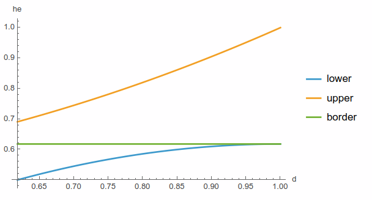{width=70%}
<figcaption>
Plot of the effect of choice of $d$ on how the Nash-equilibrium threshold (green) gets split into lower (blue) and upper (orange) border for "he" player once he gets the `we`$>d$ information. Intuitively, if he got an information that `we`$<d$, for $d=1$ he gets no information, so the border doesn't move. For $d=$Nash threshold, the border drops to $1/2$: as he knows we will be rerolling, he has an edge even for $1/2+\varepsilon$.
</figcaption>
</figure>

Initially, I struggled with control and syntax a bit:

1. the parameters (input variables?) in Mathematica need to end with `_`, and functions/constants cannot have underscores in the name; being used to python conventions, this wasn't my first choice and the errors I was getting not pointing me in the right direction
2. despite Mathematica having built-in LLM chat for support it was pretty unhelpful: I ended up using Claude in a separate window which was able to guide me better.

Once I had access to this tool, I was able to get to the solution without further difficulties. It might be worth to note that the edge coming from "cheating" in this game is relatively small: with the optimal strategy, he is able to win ~50.7% of the time against a Nash opponent and ~50.6% against best-responding one.

## Annual Summary: 2025 puzzles

Doing the puzzles every month for a year gave me a good impression of the types of challenges present.

I would classify the 2025 puzzles in following categories:

- math-heavy probability problems: July, December
- simpler math-only puzzles: April, October
- linguistic puzzles: February, August
- grid-like puzzles expressible in the linear-programming optimizer: January, March (although optimization was simple enough that a solver was not needed), May, technically June (although the optimization was only a small part of it), September, November.

Working on all of these made me learn a couple of tools/techniques I wasn't aware of / proficient in before:

- ortools
- SymPy
- Mathematica

and helped me refresh some game theory basics. Overall, I didn't feel like I learnt a lot of new math, but working on the puzzles was fun nonetheless.

On the other hand, I wasn't able to solve any linguistic ones and I'm not sure how would I improve there.

After a year, I felt the puzzles started to be a bit repetitive; while they keep being interesting[^4], I don't feel I was learning new techniques by the end of it.

[^2]: I particularly liked the November box one, despite not solving it

I think, going forward, I might attempt the linguistic ones to improve there but probably won't focus on the ones I have an idea for an approach direction from the start.

## AI performance

2025 was a year where the performance of LLMs for thinking-heavy domains (coding?) went from non-existent to ubiquitous. 

While I tried to avoid using them to solve the core of the puzzle (that would defy the purpose), I attempted to use them as a tool to resolve particular subproblems and sometimes tried to re-solve the puzzle once I had the solution to double-check / evaluate their current performance.

Here are a couple of domains I tried using LLMs for and their performance[^3].

[^3]: Note: I was checking the LLMs available at the time of a puzzle, the current tools might have improved between Dec 2024 and 2025.

### Designing algorithms

I tried using LLMs for finding an algorithm for checking if a given net can be folded into a box in the November puzzle. I thought there is a known algorithm for this and AI will be able to find and condense it for me quickly.

While Gemini was trying to convince me that there is a simple algorithm, the details were missing. I was trying to implement it with many iterations of using Codex CLI on the highest thinking settings, but it wasn't able to get anywhere.

In parallel, I also asked ChatGPT's Deep Research to search for relevant papers: while none of them ended up actually useful for the puzzle, they definitely felt relevant and interesting.

### Reading pictures

Many of the puzzles were described on a grid. While copying the grid entries to the code was a very simple part of solving the puzzle, it's something I tend to make errors in, and often wanted to have something double check my entries.

Unfortunately, despite the overall improvement of AI capabilities, LLMs consistently struggled with reading pictures.

For example, in the May puzzle, I gave Gemini access to my ortools code with the indices of yellow fields in the grid and the picture and asked it to tell me whether they match but, despite a number of retries, it consistently chose the yellow cells incorrectly.

I re-checked the performance on the November (box) puzzle after the upgrade to Gemini 3, but it was also struggling with recognizing which entry is in which cell in a grid.

### General thinking

In the two math-heavy problems, I tried using AI to help with the "thinking" part of the puzzle: finding the general solution and solving the related integrals.

I did this first in the July one, asking Gemini to only solve the integrals there: they were relatively simple but calculating them was tedious: it involved double integrals or piecewise functions and there were a couple of them.

I was positively surprised that Gemini was able to solve the integrals correctly for me.

Once having the solution, I tried solving the problem end-to-end, to evaluate how good the model would be. As I was worried that it'd be too difficult, I asked Gemini to only formalize the problem (the integral to solve), without actually solving it: I hoped that this way the model would have a good chance of getting it right.

It turned out that Gemini parsed the problem roughly correctly but still ended up with an incorrect (much simpler) integral that it tried to solve at the end. It did seem as if the model's thinking budget was too little for it to solve the full problem, so it started to cut corners to get a simpler problem despite me encouraging it to focus only on the right formulation.

I observed a similar behavior with ChatGPT and Gemini on the December problem: in there, I wanted to verify the integrals that I calculated in Mathematica. When asking the models to do small steps, they[^4] were doing well, but when presented an end-to-end problem, they were making arithmetic mistakes on the way.

[^4]: The thinking versions, Gemini flash was constantly getting confused

It feels like the general performance of the models in the "math solving" domain would be sufficient for solving these puzzles, had they had access to more inference-time compute.
