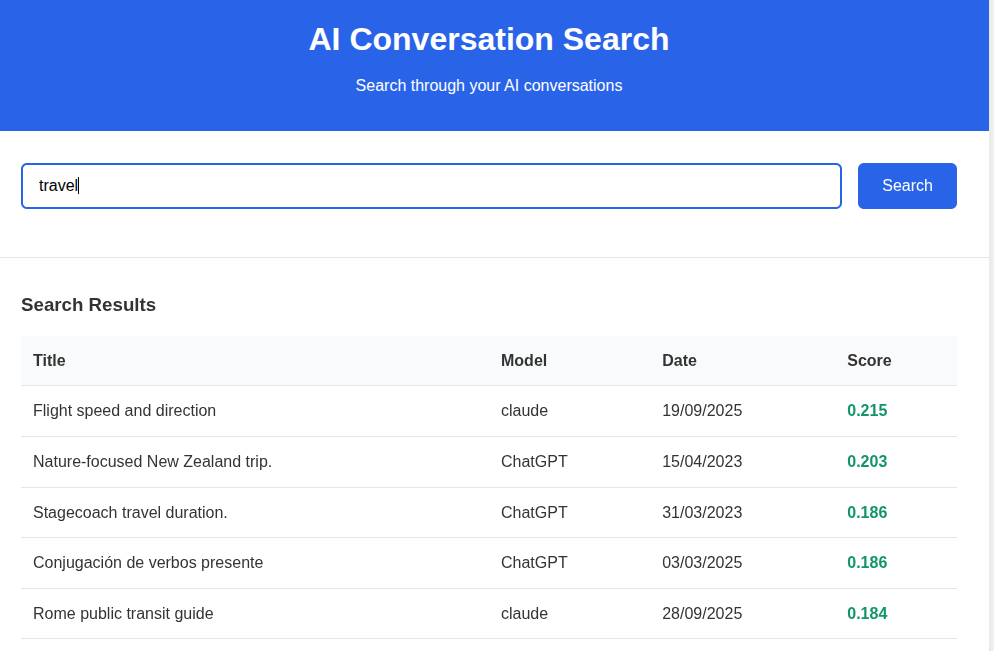
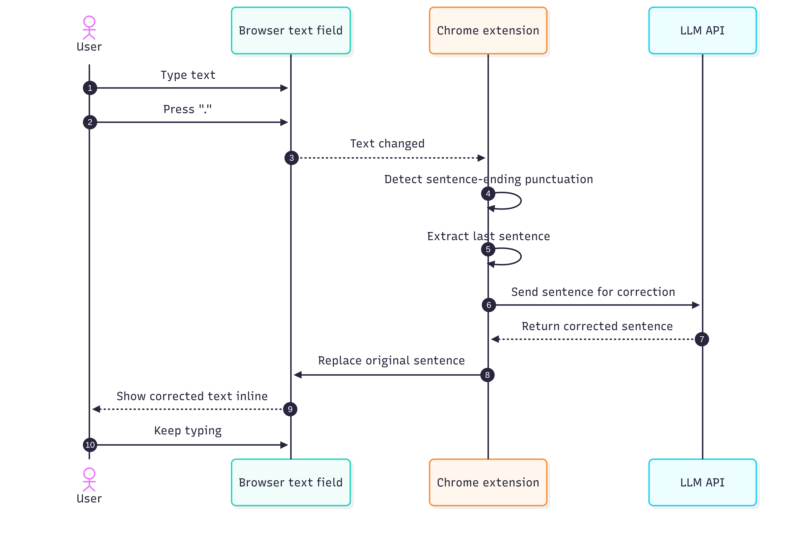
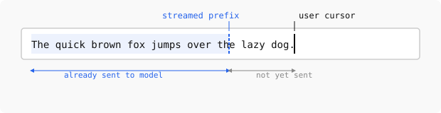

Recently, I built three small AI-related projects. The common theme was simple: using LLMs to write custom software is now easy enough that it is often worth trying an idea instead of debating it for a week.

At the same time, the interfaces around popular LLM tools still feel primitive.
There are many obvious improvements to make so it makes sense to prototype them quickly.

This post describes my journey with these projects.

## Searching AI conversation history

The first project was a search engine over my Claude and ChatGPT history.

The built-in history search in these tools works surprisingly poorly: I often remember that I had a conversation about something but I cannot find it using the built-in history.

Even when it works, it only searches history of one model at a time: this is annoying if you use several models and vaguely remember that "I already discussed this with some AI a few months ago" but do not remember which one.

So I took my conversation history, stored it in [Pinecone](https://pinecone.io), and built a tiny web UI on top.
The interface was intentionally minimal: one query box and a list of relevant results to click on.

<figure>
{width=80%}
</figure>

The difficult and boring part was auth: I wanted the history to be accessible only after OAuth, so I served it from GCP despite my previous bad experiences with it.
All the IAP settings etc required a number of steps to get running and felt very over the top.

Pinecone, on the other hand, was great.
You send text to store it.
You send text to query it.
It works.

The semantic search it provided is obviously better than whatever comes out of Claude/OpenAI.

## An AI corrector for every text field

The second project was a Chrome extension that corrects text in any text field.

The motivation was simple: when writing to people, one wants to correct the text, making sure there are no typos etc. However, when writing to llms, one can write very fast with errors as they will still understand you. I wanted to bring the llm-writing speed to my human conversations by using an LLM to correct the typos before I would send the messages to humans.

The interface was simple.
When I finished a sentence with `.`, `?`, or `!`, the extension would send the sentence to an LLM (in this case some Gemini Flash as it was fast and free), get a corrected version back, and replace the text immediately.
In principle, this should feel seamless: one keeps typing, model fixes grammar and wording in the background.

This sounded better than it felt.

The first problem was trigger detection.
A dot does not always mean "end of sentence".
Sometimes it is part of a URL, a shortcut, a decimal number, or some half-finished thought.
I tried to patch this with a few revisions, but the basic idea remained shaky.

The second problem was cursor handling.
Replacing text inside arbitrary browser text fields is messier than it sounds.
In some fields the cursor would jump around, what breaks the experience.

<figure>
[{width=80%}](../images/three-ai/correction-flow.png)
</figure>

I think the general direction is right, but the execution needs to be perfect for it to be acceptable. I think for me the next step would be to disable the auto-correction and instead only trigger it at a shortcut. This would prevent surprises in weird places and allow the user to only correct when they are actually typing fast and have a text full of typos.

That is a recurring theme with AI products: we hear a lot about model quality and not enough about interaction quality. In this case, the model is well good enough but the interface is nowhere there.

## A faster desktop frontend for LLMs

The third project started from the experience of using LLMs desktop apps on Linux. None of the popular providers support it properly; only Claude can be packaged to Linux because it is an Electron app. This has a few issues, but at least runs. Ideally, I wanted a single desktop frontend that would support several LLMs and feel faster than the official clients: the Claude desktop required multiple seconds until the first token of the answer which felt surprisingly slow.

I felt this could be improved because the model should already be doing useful work while the user is still typing. My idea was to start sending the prompt early, keeping the model perhaps 10-20 characters behind the user, so that when Enter is pressed, most of the prefix has already been processed and only the tail end remains to be handled before the model responds.

At the same time, if the user needs to correct something in the prompt, they would be able to do that without losing the cache, as long as they don't go back with cursor more than 20 charcters.

<figure>
{width=85%}
</figure>

I expected the implementation to be straightforward: open a connection, stream text or tokens as the user types, keep a small lag behind the cursor, and finalize when the user presses Enter.

That expectation was wrong. Claude does not support input streaming at all. OpenAI models only support it for audio, but not for text, despite the recent move toward websocket-based APIs. At the moment, the only major option I found that supports this for some models is Gemini.

This was a surprisingly disappointing result because a lot of the slowness of current chat interfaces looks self-inflicted by API design rather than by some deep limitation of the models: the models still process the text token-by-token and construct a KV cache for autoregressive sampling.

However, until these streaming primitives are not exposed, it's not easy to resolve my issue with a clean solution.

I did think about hacks, though. One possible workaround would be to send an early prefix, ask for a trivial one-character response, and then send a second request whose input starts with the first one, hoping to benefit from prompt caching. This could probably be made to work, but it would require extra connections and would make the user pay for the same input multiple times (what would be more severe as caching only works for at least 1024 character prompts), so it did not feel like a valid solution.

| Provider | Desktop support on Linux | Text input streaming support |
|----------|--------------------------|------------------------------|
| Claude   | Partial: Electron app can be packaged | No |
| OpenAI   | No | No for text input streaming | 
| Gemini   | No | Yes, for some models |

I wrote down some architectural notes for how to build this properly, but then got sidetracked. Part of the reason was that I am not a heavy Gemini user, so the one provider that seemed technically promising was not the one I most wanted to use. 
The other part was that as I wanted the code to be fast and for me to understand the decisions, I tried learning Rust to use it in the project.

## Learning Rust with Codex

This detour was more fun than I expected. I asked Codex to come up with a Rust curriculum and go through it with me, explaining the concepts, giving me exercises, and asking follow-up questions. We covered a number of topics this way and my impression was that after about five hours I understood the basics well enough to keep going on my own.

This feels the better given that I tried a similar experience with competitive programming ~half a year ago, and at a time the experience wasn't as good: the model would come up with invalid points, would rephrase problems making them simpler/harder and generally wasn't a good teacher.

## Conclusion

These three projects left me with some thoughts. On one hand, writing custom AI-adjacent software is easy now, even for ideas that would have felt too small or too annoying to justify a project a year ago.

At the same time, the official interfaces for LLM tools are still immature. The history search is weak, there is no ai-enabled writing correction on Linux, desktop app support is inconsistent, and latency is way larger than one would expect.

I expect a lot of useful AI software over the next few years to look quite small: not giant breakthroughs, but many local fixes to bad interfaces, because that is where a lot of the low-hanging fruit still is.
