Staying fit is important for health reasons, but I don't particularly enjoy exercising for its own sake. To encourage myself to move more, I gamified the experience and looked into rhythm games.

## Dance Dance Revolution

I recently noticed that I had put on weight and generally wasn't as much in shape as I used to be. I looked into video games that require exercise; I like playing games and hoped that, by combining the two, I'd build the motivation to work out.

I remember that, a decade or two ago, there was a console, the [Nintendo Wii](https://en.wikipedia.org/wiki/Wii), where the controller was like a remote that you moved around. I hoped that by now there would be dozens of similar devices and games.

I was disappointed to find that the Wii itself was discontinued many years ago and that the closest thing I found was [Nintendo Switch Sports](https://www.nintendo.com/en-gb/Games/Nintendo-Switch-games/Nintendo-Switch-Sports-2168292.html): an extra controller for the Switch and a couple of sport-themed games to play.

I wasn't particularly motivated by the suite of games; I usually like to play games with a lot of story and exploration and simulating sports at home felt like combining the unwanted properties of gaming and exercising.

Then, for a work social we went to [Activate](https://playactivate.co.uk/). It is a place with a number of rooms where teams of a couple of people compete in exercise-related games: avoiding lasers, touching buttons in some order, standing on the right tiles on the floor, etc.

<figure>
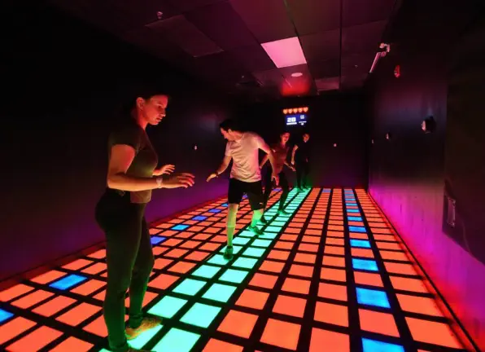{width=60%}
</figure>
I really liked the experience and explored what it would take to simulate it on a smaller scale at home. I got as far as discussing with an LLM what the electronics for building a 10x10 walking grid with games would look like.

I have a little bit of spare room at home, but it's nowhere near enough to dedicate a couple of square metres permanently to a grid like this, not to mention putting in the effort to set it all up without any guarantee that I'll actually like the playing experience in the end.

I then remembered [Dance Dance Revolution](https://en.wikipedia.org/wiki/Dance_Dance_Revolution) (DDR) machines: arcade games with a number of songs to choose from and a chart defining how to move on a 4-button "arrow" grid following the music.

<figure>
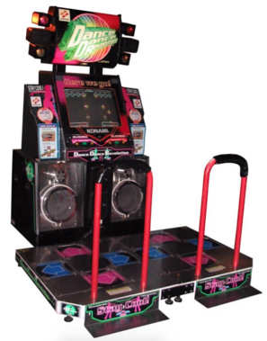{width=45%}
</figure>
Initially, I was hesitant to try it, as I'm not into music at all. I used to listen to music a bit in ~high school, but haven't really listened to it since.

However, I decided to approach DDR as a game controller: it is a device that maps foot movement to keyboard presses. As such, it can be used with any game, as long as it doesn't use too many keys[^1].

[^1]: while the standard DDR has 4 arrow keys, some supported all 9 panels; these make it easier to work with non-standard games.

### Looking for games

I was looking around for games that people played using DDR.

There are two classic dance games available on computers:

1. [ITGMania](https://www.itgmania.com/)
2. [Project OutFox](https://projectoutfox.com/)

I was also looking for other types of games. I found [Crypt of the NecroDancer](https://store.steampowered.com/app/247080/Crypt_of_the_NecroDancer/) and [Ragnarock](https://www.ragnarock-game.com/home/).

Some LLM also suggested I should be able to play Overcooked with a 9-button pad. I really liked Overcooked, so I was keen to try, although I wasn't convinced it would work well gameplay-wise.

<figure>
[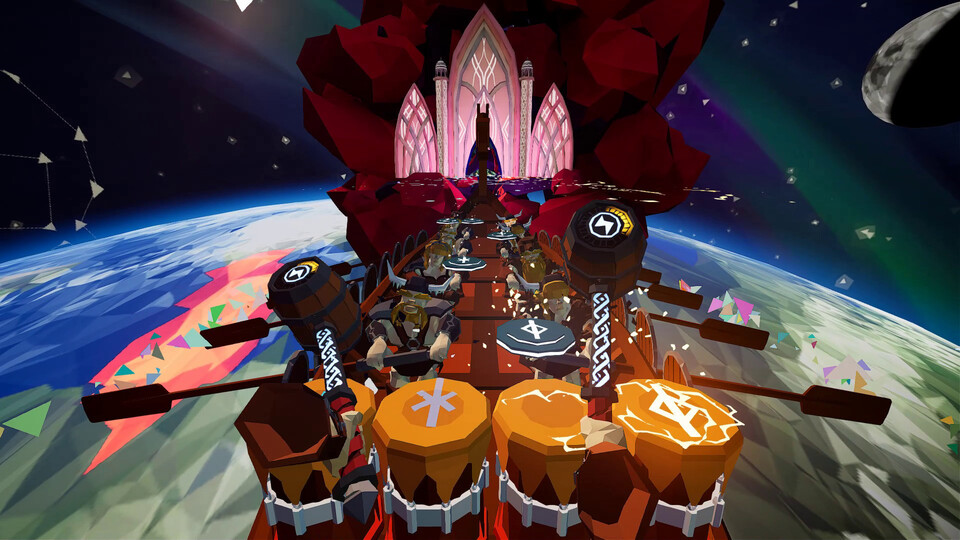{width=60%}](../images/ddr/ragnarock.jpg)
<figcaption>
Screenshot from the Ragnarock game.
</figcaption>

</figure>
Of all of them, Ragnarock, looked particularly appealing. While I haven't been listening to music in a while, when I did, I preferred heavy metal / progressive rock, and Ragnarock's style (and choice of songs) fitted that well.

### DDR hardware

As I grew confident that I would find something to play with the DDR pad, I started looking for hardware to buy.

There are a couple of tiers of pads to choose from, in increasing price order:

1. soft pads: very cheap, basically a layer of plastic film with sensors. They are known not always to register presses and to move around
2. foam pads: the same as above, but with hard foam inserted inside. This makes them respond to presses better and move less, but they still don't give physical feedback on whether a button is pressed
3. metal pads: sturdy pads that give feedback when the button / panel is pressed. "Internet professionals" recommend these as a starting point. They are noisier than the foam ones.
4. proper arcade pads, with a bar, costing thousands of dollars

Within the metal pads category, I was looking at two options:

1. [Cobalt Flux Pro](https://cobaltflux.org/?srsltid=AfmBOorY7gKjBB0t-rF85Ta_vfzpfstZ5CiFPS5fVnzXhBeoQWbTKYq9)
2. [L-TEK pad](https://dancemats.co.uk/shop/ltek-core-dance-mat/)

L-TEK is a Polish company which is a market leader in dance pads: people online consider their products to have the best quality in each category. I looked at two pads: a foam one with 9 buttons and a metal one with 4.

Cobalt Flux Pro is a metal pad with 9 buttons, but unfortunately, the company making the pads stopped operating a couple of years back. There is an enthusiast in Ohio who reproduced the relatively simple assembly instructions and sells [DIY kits](https://ddrpad.com/products/diy-pad-kit) where you assemble the pad yourself[^2].

[^2]: and even made the [assembly instruction](https://ddrpad.com/pages/cobalt-flux-diy-pad-guide?srsltid=AfmBOooRO9t9GC7UyQFbTEJnagoxOT2qsY3cLpmgL0hH0vEWTfjwF1FZ) public

I was seriously considering getting the parts from him, but ultimately decided against it for two reasons:

- the delivery costs: I would need to pay ~200 USD for delivery alone and while the total wouldn't be crazy, it felt wasteful to be shipping all the heavy stuff from the US
- I was worried about my level of motivation. I hadn't tried using the dance pad yet and wanted to avoid a situation where I spent a lot of time assembling the kit only to decide that I didn't like the games[^3].

[^3]: or, even worse, get demotivated during the assembly process

Given the information above, I decided to go with the foam pad from L-TEK: it had 9 buttons, so I would be able to try more games and learn whether I liked it and what I needed after trying it for a bit.

<figure>
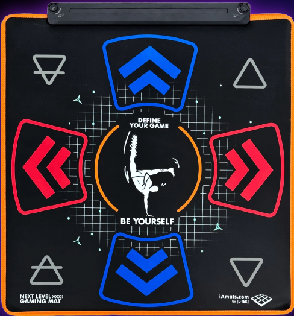{width=50%}
</figure>
L-TEK has a lot of products available on [its website](https://www.iamats.com/). One cool offering is that you can [customize the background](https://www.iamats.com/shop/panel-customization-x/) of the pad relatively cheaply.

However, sadly, due to Brexit, they don't ship to the UK through their main website[^4]. Instead, they work with [a local importer](https://dancemats.co.uk/shop/ltek-next-level-gaming-mat/), who a) doesn't offer customization (which makes sense; they probably ship in bundles) and b) charges roughly twice as much.

[^4]: What is more disappointing is that they seemingly support any other country (not only in the EU): the US, UAE, New Zealand...

### Trying out various games

#### Ragnarock

Ragnarock is about acting as a drummer whose music motivates Vikings to row a boat. I started out by trying it. I liked the interface, the story, and surprisingly also enjoyed the music.

However, it was clear that the drumming-based mapping wouldn't work well for dancing: in Ragnarock, even in simple songs, there is often a set of repeated two-button presses. It would be easy to play on drums / VR: you just keep pressing the same two drums together.

On the dance pad, it's difficult to keep jumping both feet at the same time; probably not impossible but definitely not a beginner move.

<figure>
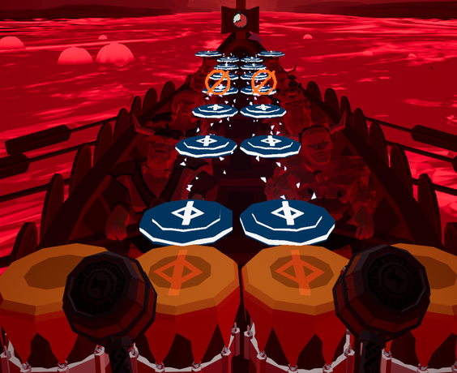{width=60%}
</figure>
#### ITGMania

ITGMania is the most popular, open-source dancing game for PC. It works like the arcade games: music plays and arrows float to the top of the screen. Once an arrow is in the top row, the player needs to press the corresponding button on the controller.

I tried playing it, but I felt the interface was too shiny, the difficulty was too high even for the very simplest songs, and I didn't enjoy the type of music available there out of the box.

<figure>
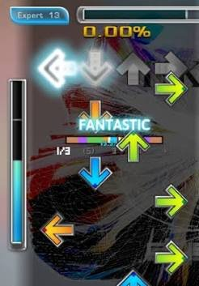{width=35%}
</figure>
#### Project OutFox

I moved to Project OutFox, which is also primarily a dancing game. It has a couple of "modes" for other rhythm games, like Guitar Hero, but I never managed to make them work.

#### Getting charts

Still, I wanted to play metal songs, which is not a standard preference in the community.

I started by searching for charts online. I found an [ITG Wiki](https://itgwiki.dominick.cc/) website with a lot of information related to DDR: buying hardware, overviews of different programs, pointers to chart packs, guides, etc.

I found some packs marked as "rock" or having songs by artists I knew. Many of them either started out very difficult or were low-quality charts (as they are fan-made with no rating system, it was hit and miss), but overall I was able to find some songs to start with, e.g. in the [Wavanova](https://stepmaniaonline.net/pack/8519) pack.

Then, I decided to try to convert the charts from Ragnarock to a more dance-friendly format. I asked people on the Ragnarock discord for advice and, while they were hesitant that this process could be automated, they pointed me to an instruction on how to extract the Ragnarock charts.

I was surprised by how accessible the individual files were after disassembling a Unity binary of the game. The annoying part of the process was that the programs people use for disassembling are supported only on Windows, so, after a couple of attempts, I got a Windows VM to extract the Ragnarock files. The silver lining was that I learnt that you can get [a limited-time licence](https://www.microsoft.com/en-gb/software-download/windows11) for some Windows versions for free these days.

Once I got the Ragnarock charts, I pointed Codex to a [charting guide](https://docs.google.com/document/d/1bb_C6kpYbDUG-AlCmOJAIJQPzdD5x1WRZlXJBwyIdqs/edit?tab=t.0#heading=h.2v6trqy19157) that I found on the ITG Wiki website and, after a couple of iterations, got a couple of songs from Ragnarock ready to be played in Project OutFox.

#### Overcooked

I tried playing Overcooked on the pad by mapping the diagonal arrows to "pick up", "chop", and "rush". The game seemed playable but it was difficult and didn't seem to be as dynamic: waiting for the character to chop felt boring.

I had been using our streaming setup: we stream the game from a desktop to a TV in a neighbouring room. It wasn't very clear to me whether the reason the game was difficult was the dance-pad interface or higher-than-usual latency, which made Overcooked's controls tricky.

#### Crypt of the NecroDancer

Crypt of the NecroDancer is a roguelike about walking in dungeons while following the rhythm of the music. It seems to be specifically written to be played on the game pad. There are key bindings for 4 keys (where attacking etc. is done by pressing two buttons at the same time), the game follows a rhythm, and you can choose the background music genre. I even found [a YouTube video](https://www.youtube.com/watch?v=5gGHskm3_j0&t=63s) where the author shows the short DDR charts that work well for particular monsters in the game.

As much as I liked the idea, the game didn't work for me. It felt way too difficult, especially at the beginning of my journey: effectively, trying to both figure out the right charts and execute them on the spot is too much.

It seems the players tend to agree; the game is considered difficult even when played on a regular keyboard[^5].

[^5]: Only 0.4% of players got a Polyamorous: Complete an "All Charts" run achievement.

## Learning to play the games

Once I settled on the Project OutFox software and figured out the hardware, I started addressing the remaining part: humanware, by learning to play the games.

Every DDR chart has a difficulty attached, going from 1 (simplest) to ~15 (hardest). Any particular song often has a number of charts with varying difficulties, with simpler ones often created by dropping some of the fast-paced notes from the harder charts.

The chart's play is scored by how far away the pressed notes are from the expected ones, with extra bonuses for combos (consecutively hit notes), etc. Typically, pressing a button when there is no note doesn't lead to a penalty, other than disrupting the natural flow. At the end, the score is summarized on an A+ (perfect play) to F (failed) scale.

Playing DDR has a genuine difficulty progression: songs with a higher difficulty are noticeably harder. When I started, I had difficulty getting anything above failed score, even on novice (difficulty 1-2) songs. I ended up widening the timing window in Project OutFox's settings to make it easier to achieve higher scores when the timings were mostly right.

After 4 or so months of playing every other day, I am slowly starting to get early cleared (non-failed) difficulty 6 songs. My impressions of how the difficulties map to charts are:

- 1-2: slow; notes appear only now and then, allowing time to prepare for the following note
- 3-4: often all the consecutive (quarter notes) from a song are being hit
- 5-6: there are longer progressions of fast notes and there are not only quarter notes: sometimes it's required to press 16ths (2x faster); one needs to start to understand the rhythm[^6]

[^6]: To visualize the rhythm better in the game, note length is marked by the colour of the arrow: red for quarter notes, blue for 16ths, etc. This is useful when a number of notes are approaching fast: some are supposed to be pressed faster, but it is difficult to see that just from the speed at which they float.

## Making the DDR pad

When I was researching the DDR hardware, my conclusion was that getting a metal pad was probably a better decision longer-term, but I initially wanted to start with something cheaper first to see if I like it.

Once I got comfortable with the simpler songs on the foam mat and was confident I had enough motivation to keep going for a while, I decided to embark on the DIY project of making a DDR pad myself.

I went for the Cobalt Flux pro direction (as opposed to buying an L-TEK metal pad) mostly because:

1. I thought the DIY part of the project would be fun
2. I wanted to be able to customize the pad

I went back and forth between trying to get the parts shipped from the US and sourcing them in the UK. I was trying to see if I could get only some parts from the US that I could bring myself or ship without spending a fortune, but there didn't seem to be a feasible solution, so I ended up getting all the parts locally in the UK.

The parts I bought were:

1. Steel base (stainless steel (304 2B) 84×84cm, 2mm)
2. Arrow panels (stainless steel, 9× ~28×28cm, 0.9mm)
3. Polycarbonate panels (9× ~28×28cm, 3mm)
4. MDF wood base
5. Velcro dots
6. Screws
7. Copper wire
8. USB encoder

I got the wooden base and the polycarbonate panels at [Cut My](https://www.cutmy.co.uk). While they had an option to drill holes in the panels, it felt pretty expensive, so I decided to do it myself.

For the stainless steel, I used [Andover Laser](https://www.andoverlaser.co.uk/). I learnt some basics of LibreCAD to design the pieces. It was quite clear from the pictures in the assembly instructions what the shape should be.

For the USB encoder, I bought [a generic arcade encoder](https://www.amazon.co.uk/Beyee-Joystick-Raspberry-Retropie-Projects/dp/B07ZQB3RQH) that people use for making retro-style arcade games. It is basically a microcontroller that maps an arcade button signal (a simple electric signal) to something to pass down a USB cable. For me, each panel was one button.

The typical standard for USB is to poll 125 times a second (8ms delay). For DDR, people sometimes make controllers that support 1000 Hz polling, giving the controller very low latency. I believe I would be able to do that by programming the microcontroller myself, but I didn't bother, as I think the computer's latency is still much higher and my skills are too low for this to matter anyway.

### Mechanism

To understand how a Cobalt Flux Pro pad works, let's consider a single panel. It consists of two sheets of steel lying on top of each other without touching, separated by Velcro. Each of the two sheets is connected by a wire to the USB encoder: one acts as a "ground", the other as "power".

When the player stands on the panel, the top sheet, being a bit flexible, bends, and touches the bottom sheet, closing the circuit. The closing of the circuit is interpreted by the USB encoder as pressing the button/arrow down.

There is a plastic panel on top of the steel to protect it.

<figure>
[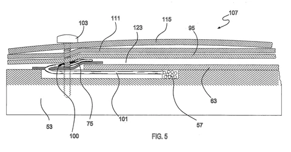{width=80%}](../images/ddr/cobalt-view.png)
<figcaption>
Cross-section drawing of a Cobalt Flux panel. Base is marked as 63 and the metal panel as 95.
</figcaption>
</figure>
The grounding sheets can be connected together, as they go to a single ground anyway, allowing the bottom grounding sheet to be a single steel piece.

In my case, as the buttons for arcade machines typically have separate grounds connected to them, I joined them together for better cable management.

<figure>
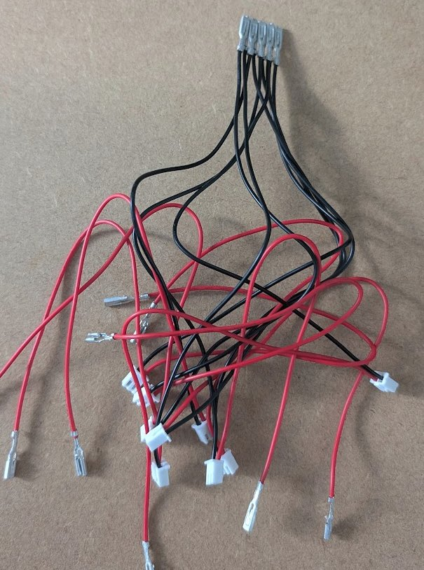{width=60%}
</figure>
### Routing cables

I started the DIY process by making a groove in the wood in which to lay the cables connecting it to the panels. I considered buying a special device for doing this—a [woodworking router](https://en.wikipedia.org/wiki/Router_(woodworking))—but decided that I'd only use it once, so it would be wasteful even if it weren't so expensive.

Instead, I followed the instructions in [this video](https://www.youtube.com/watch?v=iEd0bFCSjBo) to make a groove myself.

This ended up being the most annoying part of the process. The chisel I had was too wide, so I ended up buying two extra chisels. The process was very manual.

<figure>
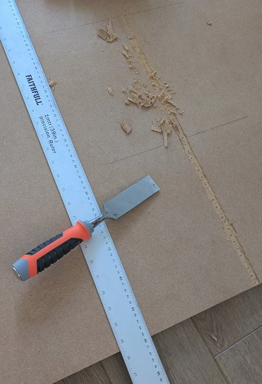{width=60%}
</figure>
Because my adapter's buttons didn't have a joint ground, I needed to make the groove deeper in the initial part.

In the middle of the drilling process, my drill stopped working. I thought it was overheating, so I left it for a couple of minutes and tried to use it again. Unfortunately, the drill kept turning off after a minute. I checked the battery, but all its indicator lights were green.

I repeated the process a couple of times, after which I thought I killed the drill for good. I tried disassembling it, but it wasn't easy.

Fortunately, it turned out that the problem was just the battery's power indicators: after properly charging it, the drill started to work again and I managed to finish the groove.

### Laying cables

The cables for the panels get attached at the corner. I drew a diagram to establish which corner of each panel is connected.

As I had 3 colours of wire—red, yellow, and black—I decided to connect the top/down/left/right panels (the ones used in the game) with yellow cables, the remaining panels with red ones, and use black for grounding (the base).

Initially, I marked each cable's end with a different colour, to know which "button connector" in the USB encoder goes to which panel, but I ended up messing it up and in the end it doesn't matter as one needs to map the final pad's buttons in the game anyway.

<figure>
[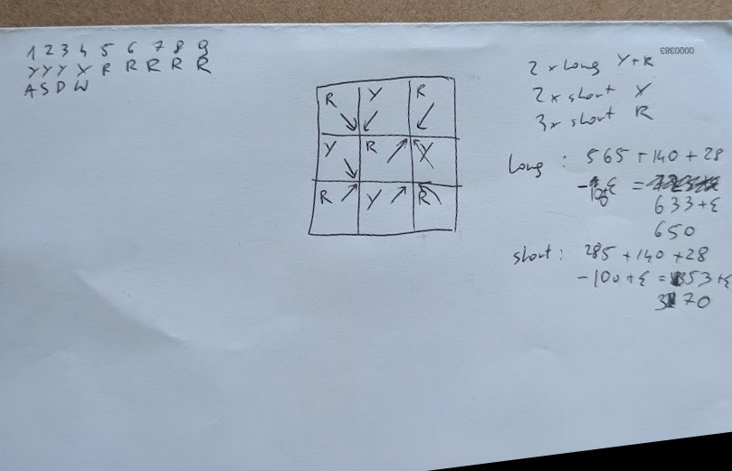{width=60%}](../images/ddr/calculations.jpg)
<figcaption>
Back of the envelope calculations.
</figcaption>

</figure>
I ended up needing wires of two lengths, for panels connected to the two grooves. I measured how much wire I would need and initially added 20 mm of spare cable. However, I quickly realized that having more would make them easier to handle, and I ended up using ~50 mm of spare cable in most places.

<figure>
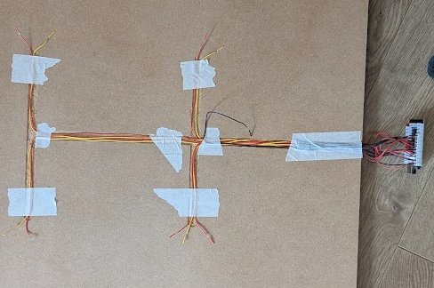{width=60%}
</figure>
Once all the cables were laid out, I tested each one of them to make sure there were no surprises before putting the base down.

<figure>
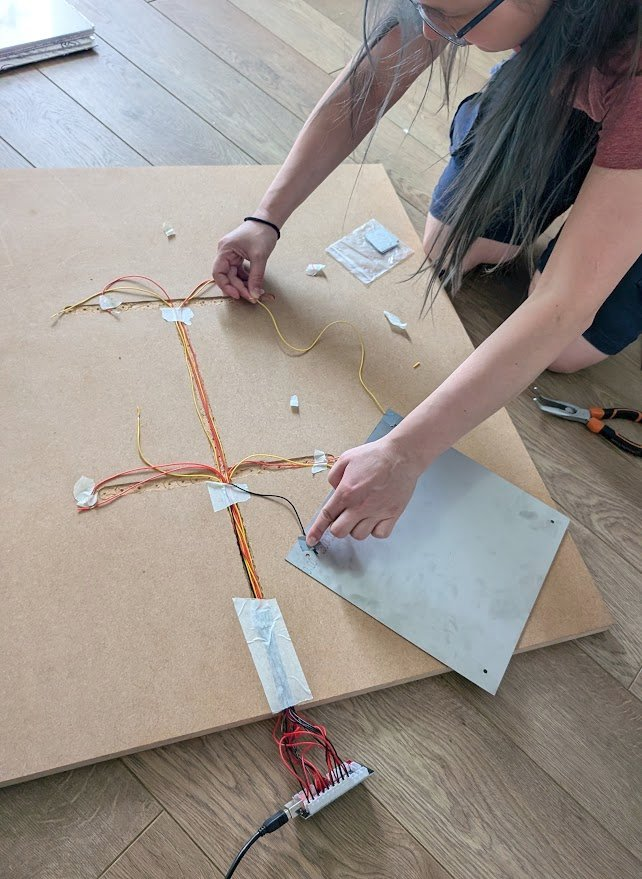{width=60%}
</figure>
### Connecting panels

Separating metal panels from the base turned out to be a challenge.

In the original Cobalt Flux docs, the authors suggest attaching a 5cm Velcro dot to the wooden base, the other side being glued to the panel in place of the screw hole, and the wire to be glued together there.

Unfortunately, it turned out:

1. I only bought Velcro dots of 20mm, not 50mm ones, so it'd be difficult to fit the cable and the screw in a sturdy way
2. the Velcro would need to be high enough to put the metal panel above the metal base while attached to the wooden base[^7], ie. thicker than the metal base itself

[^7]: as the panel's screw hole is not covered by the metal base, of course

So instead of following the original instruction here, I put two Velcros for each of the panels' corners, one side on the panel, one on top of the base. The cable was attached separately on the other side of the screw hole

<figure>
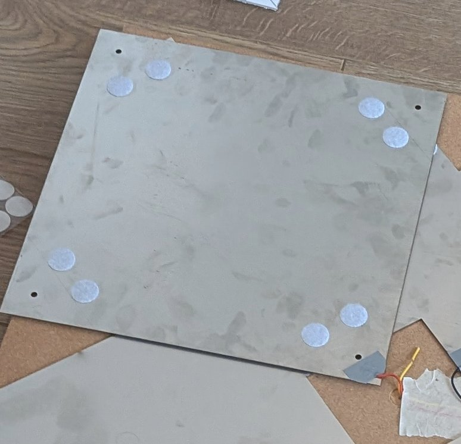{width=60%}
</figure>
Unfortunately, this meant that I needed to glue in:
$$
2 \text{ (sides of each Velcro)} \times 9 \text{ (#panels)} \times 4 \text{ (#corners)} \times
2 \text{ (#Velcros per corner)} = 
$$

$$
= 144 \text{ Velcro dots.}
$$

<figure>
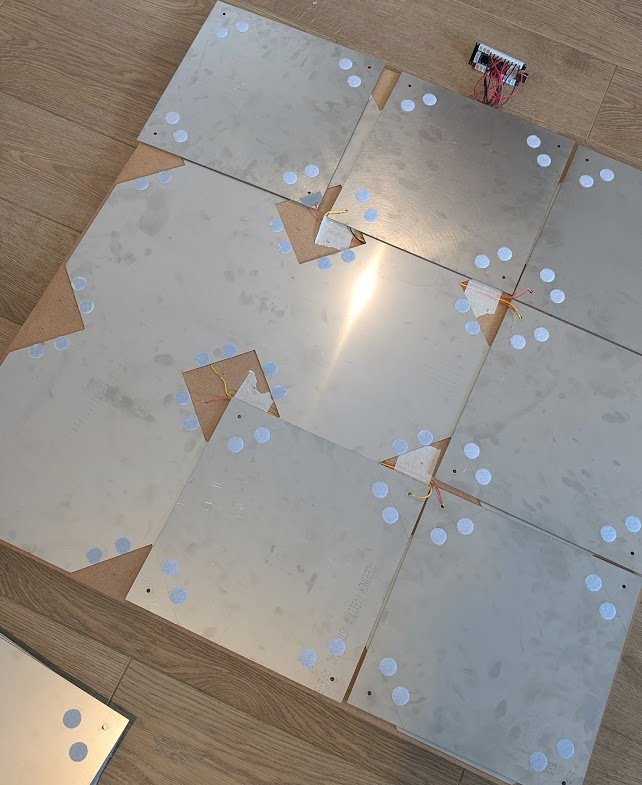{width=70%}
</figure>
### Plastic panels

To protect the metal panels from damage, every metal panel is covered by a clear polycarbonate (plastic) panel.

While the panels themselves were pretty cheap—30 pounds for 9 of them—pre-drilling the holes would add an extra 70 pounds (i.e. 100 pounds in total), which felt like a rip-off. Because of that, I decided to drill the holes myself.

<figure>
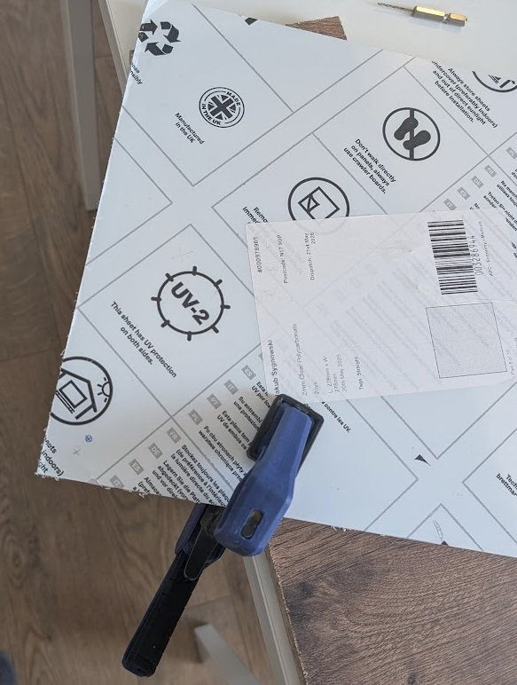{width=60%}
</figure>
After placing the panels and screwing them through to the wooden base, the pad was functional.

<figure>
[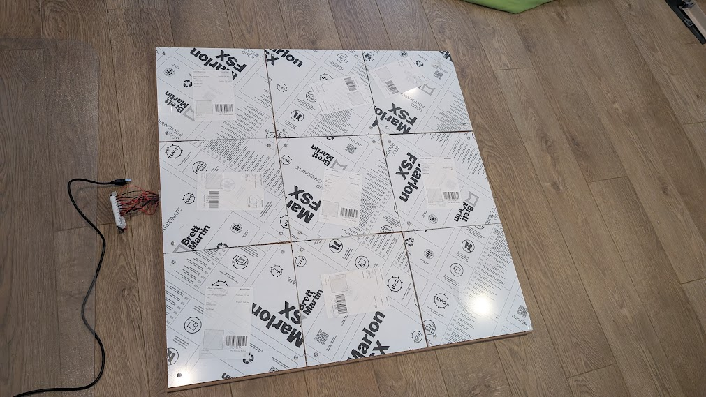{width=60%}](../images/ddr/final-pad.jpg)
<figcaption>
Pad in a working state. I didn't remove the protective film of the panels yet.
</figcaption>
</figure>
### Background picture

As I'm doing the DDR pad myself, I can customize how it looks. I don't like the standard DDR/L-TEK designs, which focus on the "dance" part.

Instead of using generic arrows, Michalina offered that she'll design something nicer. 

I plan to attach it by printing it as a vinyl sticker and then sticking it on the bottom side of the clear panels.

It takes a while to create a high-quality picture like this, so this part is not yet finished. I plan to add a picture here when it's done.

### Wheels

Once everything was assembled, the pad worked just fine. However, moving it from where it's stored (standing upright) to the front of the computer, where it's used, was a challenge: the pad is pretty heavy and inconvenient to pick up.

To make it easier, I bought a set of small caster wheels and screwed them into one side of the wooden base. I screwed one of them too close to the neighbouring edge, which resulted in a small dent in the MDF; when I realized this, I moved the other one further from the edge.

Apart from moving around, picking it up and down is also tricky: there is nothing to pull by. I was looking into how I could attach a handle but I was advised against attaching it to the side (in the same way I did wheels) to avoid breaking the MDF. 

Unfortunately, I left very little (~3mm each side) breathing space of the wooden base outside of the metal base, which makes it difficult to attach the handle there, so I decided to leave it be for now.

### Penny modding

In the DDR space, there is a concept of "penny modding" Cobalt Flux or other similar pads. It works like this: to increase the sensitivity of the pad, one adds a piece of metal between the metal base and the metal panel: thin enough so that they don't touch immediately at rest, but thick enough to decrease the panel's travel distance.

When buying the materials, I considered it and bought conductive adhesive tape and some extra pieces of stainless steel, but in the end, I don't think sensitivity is a problem for me, so I didn't apply this mod.

## Drumming

I still wanted to scratch that itch from Ragnarock. I liked their lore: commanding a viking vessel with drumming. I didn't want to play with the keyboard; if I'm going to do drumming, let's learn how to use drums.

I looked at a couple of electronic drum sets and settled on the [Donner Beat Go](https://uk.donnermusic.com/products/donner-beat-go-electronic-drumset?currency=GBP) for its small size. It has more than I need: not only 4 drums but also 3 cymbals + 2 kicks, though I'm not using them[^8].

[^8]: Apart from 4 drum "buttons", Ragnarock uses 2 more buttons for hitting combos, for which I use cymbals.

It can be connected to a PC via MIDI. With the help of my favourite LLM, I wrote a simple program mapping the MIDI signals to keyboard presses, allowing me to play Ragnarock with the drums.

Initially, I had a problem with the drums not always picking up when I was drumming "gently". It turned out the set has a "cross-fire" setting where it doesn't trigger if it thinks the vibration is due to a neighbouring drum being hit. This was annoying and happened particularly often when hitting two drums at the same time.

I found some settings in there to change this; they were meant to be possible to save, but saving only worked every now and then. I wrote to the producer hoping they'd give a small voucher for another product or something, but they offered to reimburse the whole purchase, which was very kind of them :)

### Learning drumming / Ragnarock

The mapping system in Ragnarock is quite similar to the one in DDR: each song has a couple of maps, with varying difficulties.

The scoring mechanism is slightly different, with combos that one "activates", but it overall follows the same pattern of scoring "how accurately each note is being hit".

The maps in Ragnarock are generally of much higher quality, and span a wider range of difficulties, than those in DDR. This makes sense, as this game is a commercial product, so the team behind it tested the maps well.

There is also a big community making custom maps. They support ratings, so one can hope to discern high-quality maps. I haven't tried them out though, as I'm still far away from exploring all the maps that the game came with.

While my main motivation came from wanting to play Ragnarock songs, I didn't want to learn bad habits that would block me later. To avoid that, I watched a couple of drum lessons online: how to hold a stick, how to handle rhythm, etc.

In the end, the workflow I settled on is to start each drumming session with a couple of "regular" exercises (called [rudiments](https://www.drumeo.com/beat/5-easy-drum-rudiments-for-beginners/)) with a metronome, and finish by playing Ragnarock songs to maintain motivation.

I think it is possible that I will move on to playing the actual songs end to end as part of the exercises, but so far I have mostly focused on the mechanical aspects of drumming.

## Outro

Overall, this has been a successful experiment: I ended up exercising more often than I did before, mostly because playing a game feels easier to start than deciding to exercise for its own sake. Also my girlfriend, while initially hesitant, ended up joining the dancing sessions.

I haven't lost any weight just yet. It would be interesting to track something closer to how I feel and perform: resting heart rate, how quickly my heart rate recovers after a song, how long I can play without needing a break, and perhaps the DDR performance on a given song difficulty over time.

For now, I am happy that I found a form of exercise that I actually want to come back to. The DIY pad and drums made the process more fun.
